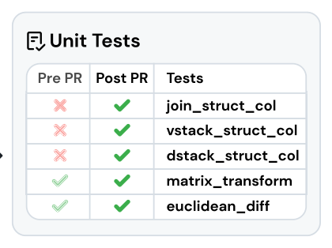
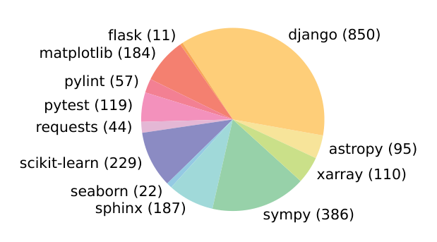
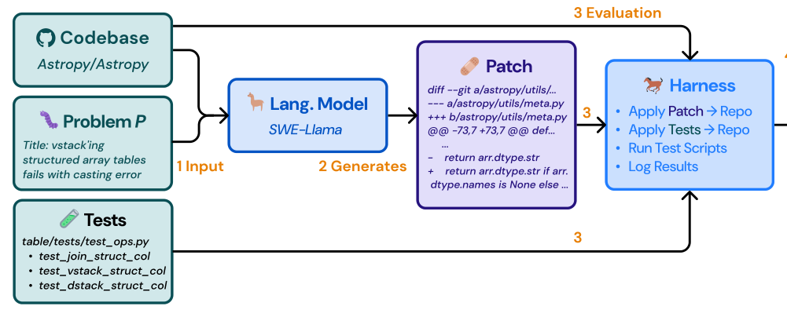
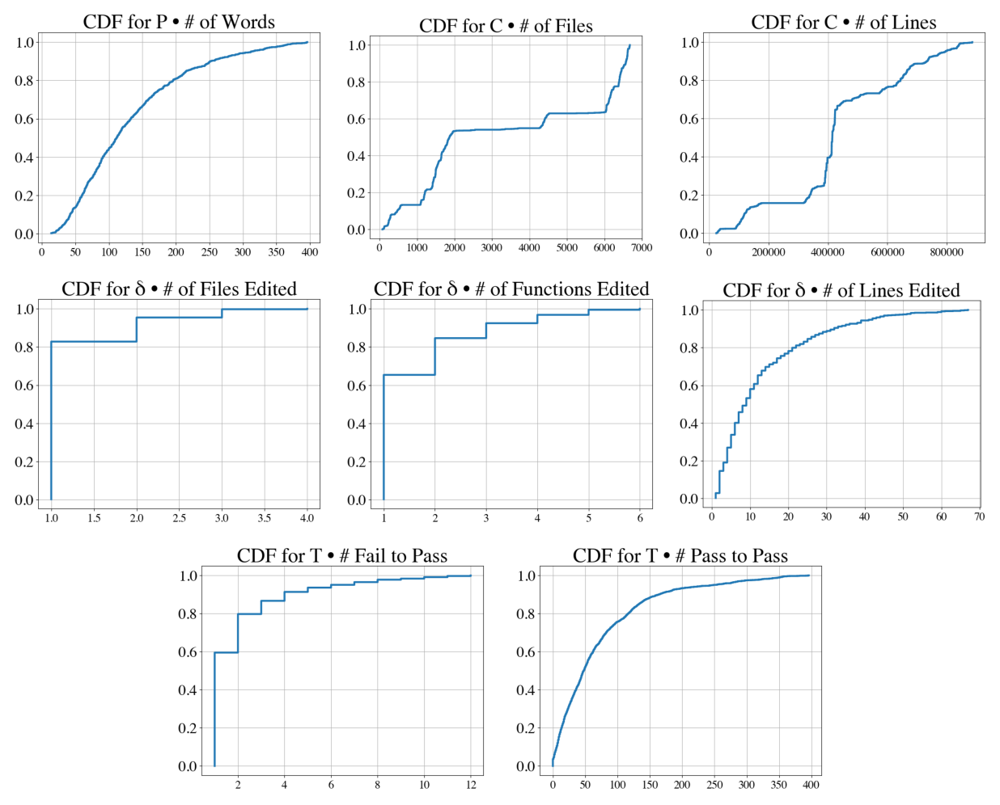

# 《SWE-bench: Can Language Models Resolve Real-World GitHub Issues?》深度解读

| 项目 | 内容 |
|---|---|
| 论文标题 | SWE-bench: Can Language Models Resolve Real-World GitHub Issues?（语言模型能解决真实世界的 GitHub Issue 吗？） |
| 作者 | **Carlos E. Jimenez\***、**John Yang\***、Alexander Wettig、Shunyu Yao、Kexin Pei、Ofir Press、Karthik Narasimhan（\*共同一作；通讯 carlosej@princeton.edu / johnby@stanford.edu） |
| 机构 | Princeton University、Princeton Language and Intelligence、University of Chicago |
| 发表会议 | ICLR 2024（arXiv:2310.06770v3，cs.CL，2024-11-11） |
| 论文链接 | [arXiv](https://arxiv.org/abs/2310.06770) |
| 代码链接 | [GitHub](https://github.com/princeton-nlp/SWE-bench)（数据、代码、leaderboard 均在 swebench.com） |
| 关键词 | Benchmark（基准）、GitHub Issues（真实 issue）、Software Engineering（软件工程）、Execution-based Evaluation（执行式评测）、Long Context（长上下文）、Patch Generation（补丁生成）、Retrieval（检索）、SWE-Llama |

**摘要（原文）**：

> Language models have outpaced our ability to evaluate them effectively, but for their future development it is essential to study the frontier of their capabilities. We find real-world software engineering to be a rich, sustainable, and challenging testbed for evaluating the next generation of language models. To this end, we introduce SWE-bench, an evaluation framework consisting of 2,294 software engineering problems drawn from real GitHub issues and corresponding pull requests across 12 popular Python repositories. Given a codebase along with a description of an issue to be resolved, a language model is tasked with editing the codebase to address the issue. Resolving issues in SWE-bench frequently requires understanding and coordinating changes across multiple functions, classes, and even files simultaneously, calling for models to interact with execution environments, process extremely long contexts and perform complex reasoning that goes far beyond traditional code generation tasks. Our evaluations show that both state-of-the-art proprietary models and our fine-tuned model SWE-Llama can resolve only the simplest issues. The best-performing model, Claude 2, is able to solve a mere 1.96% of the issues. Advances on SWE-bench represent steps towards LMs that are more practical, intelligent, and autonomous.

**摘要（中文）**：

> 语言模型的发展速度已经超过了我们有效评测它们的能力，而研究其能力前沿对模型的未来发展至关重要。我们发现，真实世界的软件工程是评测下一代语言模型的丰富、可持续且极具挑战的试验场。为此，我们提出 SWE-bench：一个评测框架，包含从 12 个流行 Python 仓库的真实 GitHub issue 及其对应 pull request 中抽取的 **2,294 个软件工程问题**。给定一个代码库和一段待解决问题的描述，语言模型需要编辑代码库来解决问题。解决 SWE-bench 中的问题往往需要理解并协调跨多个函数、类甚至文件的改动，要求模型能够与执行环境交互、处理极长的上下文，并完成远超传统代码生成任务的复杂推理。我们的评测显示：无论是当前最先进的专有模型，还是我们微调的 SWE-Llama，都只能解决最简单的问题。表现最好的模型 Claude 2 仅能解决 **1.96%** 的问题。SWE-bench 上的进展，代表着语言模型向更实用、更智能、更自主迈进的步伐。

**TL;DR（太长不想读）**：

> 现有代码基准（HumanEval 等）是"几十行内可解的自包含题"，已经饱和，无法反映真实软件工程。SWE-bench 把评测搬到真实 GitHub：从 12 个热门 Python 仓库抓取约 9 万个 PR，经"属性过滤 + 执行过滤"三步筛出 **2,294 个 issue-PR 对**；模型拿到 issue 文本 + 完整代码库，需产出一个补丁，再真实 apply 并跑测试判定是否解决。结果极其扎心——最强模型 Claude 2 只解 **1.96%**。它同时开源了训练集 **SWE-bench-train**（19,000 对、37 个不重叠仓库）与微调模型 **SWE-Llama 7b/13b**，并定义了"执行式、可自动验证、可持续更新"的 agentic 评测范式。

---

## Q: 这篇论文试图解决什么问题？（按照引言逻辑）

**引言论证链（§1）：**

1. **领域现状**：语言模型正快速进入聊天机器人与编码助手等产品，但**已有基准已经饱和**（Kiela et al., 2021; Ott et al., 2022），无法刻画 SOTA 模型的能力边界。
2. **已有基准的不足**：HumanEval（Chen et al., 2021）等编码基准大多是**自包含、几行可解**的问题；而真实软件工程远非如此——修一个 bug 可能需要**浏览大型仓库、理解跨文件函数交互、在复杂代码里定位一处小错误**。
3. **构建好基准的两难**（Martínez-Plumed et al., 2021）：任务要**难到能难住现有模型**，但预测又要**易于验证**。编码任务恰好两全：问题难，但可用单元测试自动验证。
4. **本文要填补的空白**：能否构造一个**真实、可持续更新、可自动验证**的软件工程评测集，用以衡量下一代语言模型？
5. **一句话研究目标**：> 用真实 GitHub issue + PR 构造执行式基准 SWE-bench，并给出配套训练集与微调模型，把"模型能否自主修真实仓库 bug"变成可量化的问题。

**为什么这个问题此刻重要：** 语言模型开始被期待"自主完成软件工程"，但当时缺乏一个既有挑战性又能客观验证的评测。SWE-bench 的 1.96% 这个数字，第一次清晰地把"能力前沿"暴露出来，为后续所有 coding agent（SWE-agent、OpenHands、Agentless……）提供了统一的靶场与度量。

---

## Q: 有哪些相关研究？

**① 代码生成基准（被 SWE-bench 超越/对照的对象）**
- **HumanEval**（Chen et al., 2021）：自包含函数级代码题，可执行验证，但规模与真实度有限。
- **MBPP / APPS**（Austin et al., 2021; Hendrycks et al., 2021）：入门级到竞赛级编程题，仍是"单文件可解"。
- **Cassano et al. (2022) / Lu et al. (2021) / Fried et al. (2023)**：把编辑范围限制在单函数/单类，或做成 cloze 填空——SWE-bench 明确不做这种"降难度"处理。

**② 长上下文与检索增强**
- **BM25**（Robertson et al., 2009）：本文采用的稀疏检索基线（稠密检索不适用于"自然语言查询检索代码"的设定）。
- **Lost in the Middle**（Liu et al., 2023b）：本文引用以解释"上下文越长、性能越差"的现象。

**③ 模型与微调**
- **CodeLlama / CodeLlama-Python**（Rozière et al., 2023）：SWE-Llama 的基座模型（当时少数能处理超长上下文的开源模型）。
- **LoRA**（Hu et al., 2022）：SWE-Llama 的高效微调方法（仅训练 attention 子层）。
- **ChatGPT-3.5、GPT-4、Claude 2、Claude 3 Opus**：被评测的专有模型。

**④ 相关工作定位**
- SWE-bench 与上述基准的关键区别：**任务来自真实仓库与真实 issue、改动跨文件、用仓库原生测试框架做执行式验证、且可持续更新**。

---

## Q: 论文如何解决这个问题？（额外对提及的算法和框架进行解释，是什么，为什么用，这篇文章怎么用的）

### ① 三阶段构造流水线（Benchmark Construction，§2.1）



- **Stage I — 仓库选择与抓取**：从 12 个热门开源 Python 仓库抓取 PR，共约 **90,000** 个。选热门仓库是因为其维护更好、贡献指南清晰、测试覆盖更高。每个 PR 关联一个由 base commit 指定的代码库快照。
- **Stage II — 属性过滤**：保留同时满足 (1) **解决了某个 GitHub issue**、(2) **修改了测试文件**（说明作者为验证修复贡献了测试）的已合并 PR。
- **Stage III — 执行过滤**：对每个候选，先施加 PR 的测试内容，记录施加其余内容前后的测试结果；**只保留至少有一个测试从 fail 变为 pass（fail-to-pass）**的实例，并剔除安装/运行报错的实例。
- **结果**：约 9 万 PR → **2,294 个任务实例**。

> 为什么用这套流水线：GitHub 数据噪声大（仓库/issue/PR 可能文档差、无维护），三步过滤是"在规模上找高质量任务"的可操作方案，且**几乎无需人工干预**，因此可持续更新。



### ② 任务形式化（Task Formulation，§2.2）

- **模型输入**：一段 issue 文本描述 + 一个完整代码库。
- **模型输出**：对代码库的编辑，实践上表示为 **patch 文件**（指明修改哪些行）。
- **评测指标**：用 unix `patch` 程序把生成的补丁应用到代码库，执行该实例关联的单元与系统测试；**补丁成功应用且所有测试通过**则视为解决。指标 = 解决的任务实例百分比。

### ③ 关键特性（Features，§2.3）——为什么它难且真实

- **真实软件工程任务**：需要资深工程师级的技能与知识，而非传统代码生成。
- **可持续更新**：采集流程可套用到任意 Python 仓库，可评测训练日期之后创建的 issue，**确保答案不在训练语料中**。
- **多样的长输入**：issue 平均 195 词；代码库常有数千文件（均值 3,010 个非测试文件 / 438K 行）。要在"上下文海洋"里定位那几行需要改的代码。
- **稳健评测**：每个实例至少 1 个 fail-to-pass 测试（40% 有 ≥2 个）；另有中位数 51 个额外测试检查旧功能是否被破坏。
- **跨上下文代码编辑**：参考解平均改 **1.7 个文件、3.0 个函数、32.8 行**（增删合计）。
- **解法空间宽**：可比较检索、长上下文模型、决策式 agent 等不同路线。

### ④ SWE-bench Lite（§2.4）

- 为降低评测成本、鼓励采用，从 SWE-bench 采样出 **300 个**更自包含、聚焦功能性 bug 修复的实例；覆盖 12 个仓库中的 11 个，分布与全集相近。

### ⑤ SWE-Llama：微调 CodeLlama（§3）

- **是什么**：在 CodeLlama-Python 7B/13B 上做监督微调得到的"仓库级代码编辑器"。
- **为什么用**：当时只有 CodeLlama 能处理超长上下文，但开箱版本无法遵循"生成仓库级编辑"的指令（常输出占位符或无关代码）。
- **本文怎么用**：
  - **训练数据**：按同一采集流程从**另外 37 个**热门 Python 仓库收集 **19,000 个 issue-PR 对**（不要求贡献测试）；**仓库与评测集完全不重叠**以杜绝数据污染。
  - **训练细节**：输入 = 指令 + issue 文本 + 相关代码文件，输出 = 解决该 issue 的 gold patch；用 **LoRA 只微调 attention 子层**以省显存；**剔除超过 30,000 token 的序列**，有效训练集降至 10,000 实例。

### ⑥ 检索式基线（§4.1）

- **是什么**：代码库平均 438K 行，远超上下文窗口，因此需先选"喂给模型的文件"。
- **为什么用 BM25（稀疏检索）**：稠密检索不适配——key/query 极长，且是"用自然语言查询检索代码文档"的特殊设定。
- **本文怎么用**：测试三种最大上下文（13k / 27k / 50k token），在模型窗口允许的范围内检索尽可能多的文件，取最佳；另设 **"oracle" 检索**（直接给参考补丁改过的文件）用于分析。



---

## Q: 论文使用的训练数据，结构细节，来源等详细信息（围绕可复现目标）

**① 评测集 SWE-bench（§2.1）**

| 维度 | 细节 |
|---|---|
| 来源 | GitHub 上 12 个热门开源 Python 仓库的 PR（约 90,000 个） |
| 仓库（任务数） | astropy(95)、django(850)、flask(11)、matplotlib(184)、pylint(57)、pytest(119)、requests(44)、scikit-learn(229)、seaborn(22)、sphinx(187)、sympy(386)、xarray(110) |
| 构造 | Stage I 抓取 → Stage II 属性过滤（解决 issue + 改测试）→ Stage III 执行过滤（≥1 个 fail-to-pass） |
| 规模 | **2,294** 个任务实例 |
| 每个实例字段 | issue 文本、base commit 代码库快照、gold patch、test patch、fail-to-pass / pass-to-pass 测试集合 |
| 划分 | 全集 2,294；Lite 子集 300（11/12 仓库） |

**② 实例统计（Table 1，微平均）**

| 属性 | 均值 | 最大 |
|---|---|---|
| Issue 文本长度（词） | 195.1 | 4,477 |
| 代码库非测试文件数 | 3,010 | 5,890 |
| 代码库非测试行数 | 438K | 886K |
| Gold patch 编辑行数 | 32.8 | 5,888 |
| Gold patch 编辑文件数 | 1.7 | 31 |
| Gold patch 编辑函数数 | 3 | 36 |
| Fail-to-pass 测试数 | 9.1 | 1,633 |
| 总测试数 | 120.8 | 9,459 |

**③ 训练集 SWE-bench-train（§3）**
- 从**另外 37 个**热门 Python 仓库收集 **19,000 个** issue-PR 对（不要求测试改动）。
- 与评测仓库**完全不重叠**（防污染）。
- 经 30k token 截断后有效训练实例 **10,000**。

**④ 可复现要点**
- 数据、代码、leaderboard：**swebench.com**。
- 评测可自动执行：应用补丁 → 跑仓库原生测试框架。
- 论文明确：SWE-bench 结果**不使用** issue 附带的 "hint text"。
- 成本提示：全量评测耗时/耗算力，Lite 子集用于快速迭代。

---

## Q: 论文做了哪些实验？

**实验设置（§4）**
- **输入构造**：任务指令 + issue 文本 + 检索到的文件与文档 + 一个示例 patch 与生成提示。
- **检索**：BM25（13k/27k/50k 三种上下文上限）与 "oracle" 检索。
- **模型与上下文**：ChatGPT-3.5（16,385 token，覆盖 58.1% 实例）、GPT-4（32,768，84.1%）、Claude 2（100,000，96.4%）、SWE-Llama（≥100,000，≥94.8%）。

**主结果（Table 5，BM25 检索）**

| 模型 | SWE-bench %Resolved | SWE-bench %Apply | Lite %Resolved | Lite %Apply |
|---|---|---|---|---|
| Claude 3 Opus | 3.79 | 46.56 | 4.33 | 51.67 |
| Claude 2 | 1.97 | 43.07 | 3.00 | 33.00 |
| GPT-4-turbo | 1.31 | 26.90 | 2.67 | 29.67 |
| ChatGPT-3.5 | 0.17 | 26.33 | 0.33 | 10.00 |
| SWE-Llama 7b | 0.70 | 51.74 | 1.33 | 38.00 |
| SWE-Llama 13b | 0.70 | 53.62 | 1.00 | 38.00 |

> 核心结论：最强模型 Claude 2 仅解决 **1.96%**；"能应用补丁（%Apply）"远高于"能真正解决"，说明**格式正确 ≠ 逻辑正确**。

**Oracle 检索与上下文消融**
- "Oracle" 检索下 Claude 2 达 **4.8%**。
- "Oracle-collapsed"（只保留被改行 ±15 行）下：**Claude 3 Opus 9.39%、Claude 2 5.93%、GPT-4 3.40%、ChatGPT-3.5 1.09%**——说明模型在长上下文里"定位问题代码"是主要瓶颈。
- **上下文越长性能越差**（Table 2）：Claude 2 在 13k/27k/50k 下分别为 1.96/1.87/1.22；BM25 召回率（Table 3）虽随上限提高（Avg 29.58→51.06），性能却下降。



**更多分析（§5）**
- **仓库间难度不同**，但各模型趋势一致（Fig. 4）；模型解出的实例重叠不多（oracle 下 Claude 2 解 110 个、SWE-Llama 13b 解 91 个，Claude 2 只覆盖 SWE-Llama 所解实例的 42%）。
- **难度与 issue 创建日期无关**（Table 7，前后 2023 差别不大）——说明模型不是靠"背"更新版仓库作弊。
- **微调模型对上下文分布漂移敏感**：SWE-Llama 在 BM25 上下文下表现差，因为训练时用的是 oracle 上下文。
- **生成补丁比生成整文件更容易**：让模型重写整个文件反而更差（Claude 2 从 4.8% 降到 2.2%）。
- **模型倾向生成更短、更简单的编辑**（Table 8）：模型补丁总长不到 gold 的一半（如 Claude 2 19.6 行 vs gold 44.1 行），且很少编辑超过一个文件。

---

## Q: 这篇论文的创新点和可以借鉴的地方

**真创新（范式级）**
1. **首个真实软件工程执行式基准**：从真实 GitHub issue+PR 构造 2,294 个可自动验证的任务，定义了"模型能否修真实仓库 bug"这一度量。
2. **三阶段可扩展构造流水线**（抓取→属性过滤→执行过滤），几乎无需人工，支持**持续更新**与**防污染**（可评测训练日期后的 issue）。
3. **执行式评测范式**：以"补丁 apply + 仓库原生测试通过"为唯一判定，天然容忍多种正确解法。
4. **配套训练集 SWE-bench-train + SWE-Llama**：用 37 个不重叠仓库的 19,000 对数据、LoRA 微调，推动开源模型发展。
5. **暴露能力前沿**：1.96% 这个数字成为后续所有 coding agent 的起点与靶标。

**可借鉴的技巧**
- 用**测试文件的改动**作为"高质量任务"的代理信号（Stage II）。
- 用**fail-to-pass 测试**作为可验证奖励信号（后续 RLVR/ART 的直接来源）。
- 用 **oracle vs BM25** 的对照，把"检索质量"与"模型能力"分离分析。
- 用 **oracle-collapsed** 消融定位"长上下文定位难"这一根因。
- 生成**补丁**而非整文件——更高效的编辑表示。

---

## Q: 这篇论文有哪些不足

1. **绝对分数过低，短期缺乏区分度**：最强仅 1.96%，基准对早期系统"劝退"，需 Lite 子集缓解。
2. **仅限 Python、仅 12 个仓库**：语言与生态单一，泛化到其他语言/仓库类型未知。
3. **依赖测试质量**：若仓库测试不充分或 PR 未贡献测试，任务可能被漏筛或评测失真。
4. **检索仍是瓶颈**：BM25 在近一半实例（27k 上限）检索不到任何 oracle 文件；检索与模型的耦合使归因困难。
5. **上下文长度是硬约束**：模型窗口覆盖不了全部实例（ChatGPT-3.5 仅 58.1%），且越长越差。
6. **多模态缺失**：部分 issue 含嵌入图片（matplotlib 32%、seaborn 10%），当前模型无法处理。
7. **可能的数据泄漏风险**：尽管做了前后 2023 的对照，模型训练语料可能已包含部分仓库代码/issue。
8. **"解决率"不等价于"工程可用"**：通过测试 ≠ 代码风格/可维护性达标。

---

## Q: 提炼论文的一般技术和逻辑范式

**范式：把"真实、可执行、可自动验证"作为基准构造的三原则**

```
真实数据源(GitHub issue+PR)
   → 属性过滤(解决issue & 改测试)
   → 执行过滤(≥1 fail-to-pass)
   → 执行式评测(apply patch + run tests)
```

可复用的方法论：
1. **用真实工作产物构造任务**，而非人工编题——真实度带来挑战性与可持续性。
2. **用可执行反馈做验证**：测试结果既是评测标准，也是天然的"可验证奖励"。
3. **多层过滤保证质量**：属性过滤（信号代理）+ 执行过滤（结果验证）。
4. **长输入任务要区分"检索问题"与"推理问题"**：oracle 对照是关键实验设计。
5. **防污染靠"仓库不重叠 + 时间切分"**。
6. **评测要能容纳多种正确解**：执行式判定优于字符串匹配。

**隐含假设**：① 仓库原生测试足以判定正确性；② PR 能解决 issue 意味着任务可解；③ Python 仓库可代表软件工程；④ 上下文检索是可行的前置步骤。

---

## Q: 针对这篇文章，思考有哪些值得做的研究话题

**研究主题**

- **上位类研究**：面向真实世界的 LLM 能力评测（benchmark / evaluation science）与 agentic 软件工程（agentic SWE）。
- **同位类研究**：与 SWE-bench 平行的代码/agent 基准（HumanEval、MBPP、APPS、WebArena、OSWorld、Terminal-Bench、SWE-bench Verified/Multimodal）及"静态基准 vs 执行式基准"路线之争。
- **下位类研究**：
  - 长上下文下的**代码定位（localization）**；
  - 面向代码的**检索/rerank**（稠密 vs 稀疏 vs 混合）；
  - **多模态 issue**（含图）的处理；
  - 用 fail-to-pass 信号做 **RLVR/可验证奖励训练**；
  - **数据污染检测**与基准可持续更新机制；
  - 多语言/多仓库的**泛化评测**。

**数据类型**：
- issue 文本 + base-commit 代码库快照 + gold patch + test patch + fail-to-pass/pass-to-pass 测试；
- 模型生成的补丁与执行日志（apply 结果、测试输出）；
- 若做多模态：issue 中嵌入的图片。

**研究设计**：
- **控制变量**：固定模型，比较不同检索器（BM25 vs 稠密 vs oracle）与不同上下文上限，分离"检索"与"推理"贡献；
- **对照**：oracle / oracle-collapsed / BM25 三档，量化"定位难度"；
- **指标**：%Resolved、%Apply、编辑规模（行/文件/函数）、上下文长度分桶成功率；
- **预期贡献**：给出"长上下文代码 agent 的瓶颈定位"与可迁移的检索/定位改进方案。

---

<!-- 图表来源：Fig.1 任务构造流水线、Fig.3 仓库分布、Fig.8 评测流水线、Fig.9 任务属性 CDF，均由原 PDF 裁剪（220 DPI）。 -->
