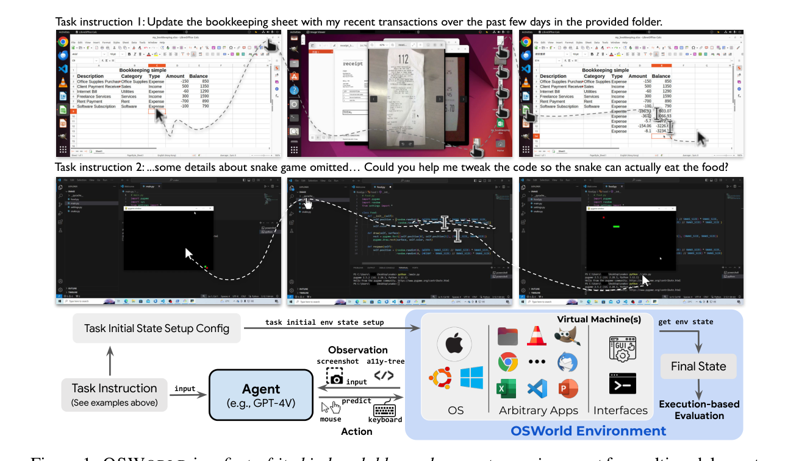
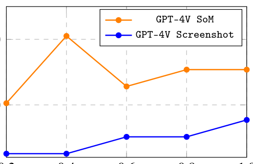
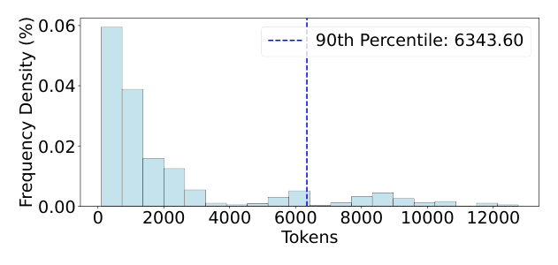
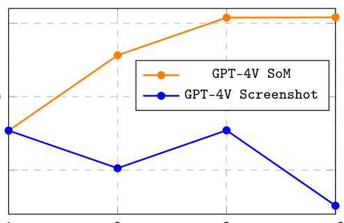

# 《OSWorld: Benchmarking Multimodal Agents for Open-Ended Tasks in Real Computer Environments》深度解读

| 项目 | 内容 |
|---|---|
| 论文标题 | OSWorld: Benchmarking Multimodal Agents for Open-Ended Tasks in Real Computer Environments（在真实计算机环境中评测多模态智能体的开放式任务） |
| 作者 | **Tianbao Xie**、Danyang Zhang、Jixuan Chen、Xiaochuan Li、Siheng Zhao、Ruisheng Cao、Toh Jing Hua、Zhoujun Cheng、Dongchan Shin、Fangyu Lei、Yitao Liu、Yiheng Xu、Shuyan Zhou、Silvio Savarese、Caiming Xiong、Victor Zhong、**Tao Yu** |
| 机构 | The University of Hong Kong（港大）、CMU、Salesforce Research、University of Waterloo |
| 发表会议 | NeurIPS 2024（arXiv:2404.07972v2，cs.AI，2024-05-30） |
| 论文链接 | [arXiv](https://arxiv.org/abs/2404.07972) |
| 代码链接 | [os-world.github.io](https://os-world.github.io)（代码、环境、基线模型、数据公开） |
| 关键词 | Benchmark（基准）、Multimodal Agent（多模态智能体）、Real Computer Environment（真实计算机环境）、GUI Grounding、Execution-based Evaluation（执行式评测）、Accessibility Tree（无障碍树）、pyautogui、Set-of-Marks |

**摘要（原文）**：

> Autonomous agents that accomplish complex computer tasks with minimal human interventions have the potential to transform human-computer interaction, significantly enhancing accessibility and productivity. However, existing benchmarks either lack an interactive environment or are limited to environments specific to certain applications or domains, failing to reflect the diverse and complex nature of real-world computer use, thereby limiting the scope of tasks and agent scalability. To address this issue, we introduce OSWORLD, the first-of-its-kind scalable, real computer environment for multimodal agents, supporting task setup, execution-based evaluation, and interactive learning across various operating systems such as Ubuntu, Windows, and macOS. OSWORLD can serve as a unified, integrated computer environment for assessing open-ended computer tasks that involve arbitrary applications. Building upon OSWORLD, we create a benchmark of 369 computer tasks involving real web and desktop apps in open domains, OS file I/O, and workflows spanning multiple applications. Each task example is derived from real-world computer use cases and includes a detailed initial state setup configuration and a custom execution-based evaluation script for reliable, reproducible evaluation. Extensive evaluation of state-of-the-art LLM/VLM-based agents on OSWORLD reveals significant deficiencies in their ability to serve as computer assistants. While humans can accomplish over 72.36% of the tasks, the best model achieves only 12.24% success, primarily struggling with GUI grounding and operational knowledge. Comprehensive analysis using OSWORLD provides valuable insights for developing multimodal generalist agents that were not possible with previous benchmarks. Our code, environment, baseline models, and data are publicly available at https://os-world.github.io.

**摘要（中文）**：

> 能够以极少人工干预完成复杂计算机任务的自主智能体，有潜力变革人机交互、显著提升无障碍性与生产力。然而，现有基准要么**缺乏交互式环境**，要么**局限于特定应用或领域的环境**，无法反映真实计算机使用的多样性与复杂性，从而限制了任务范围与 agent 的可扩展性。为此，我们提出 **OSWORLD**——首个面向多模态智能体的**可扩展真实计算机环境**，支持任务设置、执行式评测与交互式学习，覆盖 Ubuntu、Windows、macOS 等多种操作系统。OSWORLD 可作为统一的集成计算机环境，用于评估涉及任意应用的开放式计算机任务。基于 OSWORLD，我们构建了包含 **369 个计算机任务**的基准，涉及开放域的真实网页与桌面应用、OS 文件 I/O，以及跨多个应用的工作流。每个任务样例都源自真实计算机使用场景，包含**详细的初始状态配置**与**定制的执行式评测脚本**，以保证可靠、可复现的评测。对 SOTA LLM/VLM 智能体的广泛评测显示，它们作为计算机助手存在明显不足：**人类能完成 72.36% 以上的任务，而最佳模型仅达 12.24%**，主要卡在 **GUI grounding（界面定位）与操作知识**上。基于 OSWORLD 的全面分析为开发多模态通用智能体提供了以往基准无法给出的洞见。代码、环境、基线模型与数据均在 https://os-world.github.io 公开。

**TL;DR（太长不想读）**：

> 之前的 GUI agent 基准要么是静态演示（无真实环境），要么只管浏览器/单一应用。OSWorld 直接把评测搬进**真实操作系统**（Ubuntu，另有 Windows/macOS 支持）：**369 个任务**跨 8 类真实应用（Chrome、VLC、Thunderbird、VS Code、LibreOffice、GIMP + OS 基础应用），每个任务带**初始状态配置**与**执行式评测脚本**；观测是**全屏截图 + a11y 树**，动作是**pyautogui 级鼠标键盘**（+ WAIT/FAIL/DONE）。人类 72.36%、最强模型 GPT-4 仅 12.24%——它第一次把"通用计算机 agent"的能力差距量化，并指明瓶颈是 GUI grounding。

---

## Q: 这篇论文试图解决什么问题？（按照引言逻辑）

**引言论证链（§1）：**

1. **领域现状**：人类通过 GUI/CLI 在数字世界完成网页浏览、视频剪辑、文件管理、数据分析、软件开发等任务；VLM 驱动的自主数字 agent 有望变革人机交互、提升无障碍性与生产力。
2. **已有基准的不足**：
   - **缺乏交互式环境**：多数基准只提供演示数据，**非执行式评测**假设每个任务只有唯一解，会**误判其他正确解法**；也失去了交互探索的机会。
   - **环境局限于特定应用/领域**：只覆盖浏览器或单一应用，无法反映真实计算机使用的多样性与复杂性，限制任务范围与 agent 可扩展性。
3. **本文要填补的空白**：能否构建一个**基于真实交互环境、覆盖多 OS/多应用、可扩展**的基准，来评测开放式计算机任务？
4. **一句话研究目标**：> 构建 OSWORLD——首个可在真实操作系统上运行、支持任务设置 + 执行式评测 + 交互学习的可扩展环境，并给出 369 个真实任务的基准，量化当前 VLM agent 与人类的差距。

**为什么这个问题此刻重要：** "通用计算机助手"是 agent 的终极形态之一，但若没有真实、可执行、可扩展的评测场，进展无法被度量。OSWorld 把"环境"从模拟/单一应用升级为**真实 OS**，第一次让"跨应用、开放式、可复现"的评测成为可能。

---

## Q: 有哪些相关研究？

**① 缺乏可执行环境的基准（静态演示型）**
- **GAIA**（Mialon et al., 2023）：466 任务，通用助手问答，无交互环境。
- **Mind2Web**（Deng et al., 2023）：2,350 任务，网页轨迹数据集，非执行式。
- **WebLINX**（Lù et al., 2024）：2,337 任务，指令跟随，静态。
- **PixelHelp**（Li et al., 2020）、**MetaGUI**（Sun et al., 2023）、**AITW**（Rawles et al., 2023）、**OmniACT**（Kapoor et al., 2024）：移动/GUI 演示，无真实执行。

**② 有执行环境但领域受限**
- **AgentBench**（Liu et al., 2023）：多隔离环境，7 个执行式评测函数。
- **InterCode**（Yang et al., 2023）：代码环境，3 个评测函数。
- **MiniWoB++**（Liu et al., 2018）：125 网页任务，125 评测函数。
- **WebShop**（Yao et al., 2022）、**WebArena**（Zhou et al., 2023）、**VisualWebArena**（Koh et al., 2024）、**WorkArena**（Drouin et al., 2024）：仅 web 域。
- **WikiHow**（Gur et al., 2023）：移动端。

**③ 桌面/GUI agent 相关**
- **CogAgent**（Hong et al., 2023）、**Set-of-Marks**（Yang et al., 2023）、**SeeAct**（Zheng et al., 2024）等，作为本文基线或方法借鉴。

**定位差异**：OSWorld 是**唯一**同时满足"真实计算机环境 + 可控执行 + 多模态 + 跨应用 + 中间初始状态 + 大量执行式评测函数（134 个）"的基准（Table 4）。

---

## Q: 论文如何解决这个问题？（额外对提及的算法和框架进行解释，是什么，为什么用，这篇文章怎么用的）

### ① 真实 OS 环境（§2.1–2.2）



- **是什么**：一个运行在**真实操作系统**（Ubuntu 为主，Windows/macOS 支持）上的可执行环境，每个任务通过 **VM 镜像 + 初始状态配置**搭建，agent 在真实 GUI/CLI 中自由操作。
- **为什么用**：真实 OS 才能定义"所有类型的计算机任务"（跨应用、GUI+CLI 混合）；执行式环境允许 agent 自由探索，而非只预测下一步。
- **怎么用**：
  - **初始状态配置（config）**：准备任务所需文件、打开窗口、调整尺寸/顺序（基于软件与 OS API，难以 API 化的用 pyautogui 重实现）；
  - **可扩展**：提供便捷 API 配置初始条件与世界设置，标准化任务以便扩展。

### ② 执行式评测（§2.2.3）

- **是什么**：**样例级（example-wise）**的评测——每个任务配一个自定义评测脚本，由 **getter 函数**（从最终环境/云/配置提取关键成分）与 **evaluator 函数**（据此判定成功）组成。
- **为什么用**：通用计算机任务无法用统一模式或单一指标衡量；样例级评测才能容纳任务多样性与多种正确解法。
- **怎么用**：
  - 提取范围：cookie 数据、文件（本地/云）、a11y 树等；
  - 必要时**逆向工程**（如解密 Thunderbird 账号信息）、开启远程调试端口（Chrome/VLC）、为 VS Code 创建扩展；
  - 实时性任务（如论文引用数）用动态 getter（爬虫）在评测时取实时值比对；
  - 成果：**134 个**唯一执行式评测函数，远超以往基准。

> 示例（Table 1）：删除 Amazon cookie（读 cookie 数据 + 规则判定）、重命名/复制工作表（比对本地与云文件 + 表格规则）、检查邮件收件人（读 a11y 树 + 选择器规则）。

### ③ 观测空间（§2.3）

- **全屏截图**：含鼠标位置/形状、各应用窗口、文件与文件夹，保持与人类一致的感知（可达 4K）。
- **a11y 树（XML）**：Ubuntu 经 ATSPI2、Windows 经 PyWinAuto 获取，提供结构化补充信息，支持建模。
- **挑战**：高分辨率图像 + 结构化长文本，带来**长程决策**困难。

### ④ 动作空间（§2.4）

| 函数 | 说明 |
|---|---|
| `moveTo(x,y)` | 移动鼠标到坐标 |
| `click(x,y)` | 在坐标点击 |
| `write('text')` | 在当前光标处输入文本 |
| `press('enter')` | 按键 |
| `hotkey('ctrl','c')` | 组合键（复制） |
| `scroll(200)` / `scroll(-200)` | 上/下滚动 |
| `dragTo(x,y)` | 拖拽 |
| `keyDown('shift')` / `keyUp('shift')` | 按住/释放 |
| `WAIT` / `FAIL` / `DONE` | 等待 / 判定不可行 / 判定完成 |

- **是什么**：覆盖全部鼠标键盘动作的**通用动作空间**，用 **pyautogui** 库实现；agent 需生成**语法正确的 pyautogui Python 代码**。
- **为什么用**：动作可嵌入程序结构（如 for 循环），**表达力强**；相比 WebArena 等只含点击/输入，OSWorld 建模了右键、Ctrl 点击多选等**全部**计算机动作，避免能力上限被人为压低。
- **怎么用**：三个特殊动作处理时序与终止（WAIT/FAIL/DONE）。

### ⑤ Set-of-Marks 辅助（§4.1）

- **是什么**：在截图上叠加元素标记以增强空间定位（Yang et al., 2023b; He et al., 2024）。
- **为什么用**：已被证明能改善视觉推理的空间能力（GUI grounding）。
- **怎么用**：作为基线方法之一，与纯截图/a11y 树输入对比。

---

## Q: 论文使用的训练数据，结构细节，来源等详细信息（围绕可复现目标）

**① 任务与规模（§3.3，Table 3）**

| 统计项 | 数量 |
|---|---|
| Ubuntu 总任务 | **369**（100%） |
| — 单应用（Single-App） | 268（72.6%） |
| — 多应用工作流（Multi-App Workflow） | 101（27.4%） |
| — 集成自其他基准（Integrated） | 84（22.8%） |
| — 不可行任务（Infeasible） | 30（8.1%） |
| 补充任务（Windows） | 43 |
| 初始状态（Initial States） | 302 |
| 评测脚本（Eval. Scripts） | 134 |

**② 应用与领域（§3.1）**
- 8 类代表应用 + OS 基础应用：**Chrome**（浏览）、**VLC**（媒体）、**Thunderbird**（邮件）、**VS Code**（IDE）、**LibreOffice Calc/Writer/Impress**（表格/文档/演示）、**GIMP**（图像），以及终端、文件管理器、图片查看器、PDF 查看器。
- 任务分类：OS、Office、Daily、Professional、Workflow。

**③ 任务来源（§3.2）**
- 从官方指南/教程、视频（TikTok/YouTube）、how-to 网站（WikiHow）、Q&A 论坛（Reddit/Quora/Superuser/StackOverflow）、在线课程（Coursera/Udemy）、个人博客中筛选，按**流行度、有用性、多样性**（浏览/投票）挑选。
- 多应用任务缺乏现成样例，由作者头脑风暴/组合/日常场景启发构造。
- 含 **30 个不可行任务**（源于真实用户提出的已废弃/幻觉功能）。
- 集成 84 个来自 NL2Bash、Mind2Web、SheetCopilot、PPTC、GAIA 的样例。

**④ 标注成本与质控（可复现关键）**
- 9 名 CS 学生、3+ 个月、约 **1,800 人时**（650 单应用 + 750 工作流 + 400 双检）。
- 每例经另两位作者交叉检查可行性/歧义/对齐；再由不同人从"指令对齐 + 多解正确性"角度迭代检查 3 次；4 轮修复超 400 人时。
- 每例初始状态配置约 1 人时；评测开发+检查约 2 人时。

**⑤ 可复现资源**
- VM 镜像 + 初始状态配置 + 134 个评测函数 + 基线模型 + 数据，均在 os-world.github.io 公开。
- Windows 任务因版权需用户激活。

---

## Q: 论文做了哪些实验？

**人类性能（§3.4）**

| 指标 | OSWorld | WebArena（对照） |
|---|---|---|
| 人类准确率 | **72.36%** | 88% |
| 中位完成时间 | **111.94s** | 35.38s |

> 任务更长、更难（大量样例 ≥900s），说明其对理解与熟练度要求更高。

**基线设置（§4.1）**
- 开源模型：Mixtral-8x7B、CogAgent、Llama-3-70B；闭源：GPT-3.5/4、Gemini-Pro/1.5、Claude、Qwen-Max。
- 输入：a11y tree（及截图/Set-of-Marks 变体）。

**主结果（Table 5，按类别，a11y tree 输入）**

| 模型 | OS | Office | Daily | Professional | Workflow | **Overall** |
|---|---|---|---|---|---|---|
| Mixtral-8x7B | 12.50% | 1.01% | 4.79% | 6.12% | 0.09% | 2.98% |
| Llama-3-70B | 4.17% | 1.87% | 2.71% | 0.00% | 0.93% | 1.61% |
| GPT-3.5 | 4.17% | 4.43% | 2.71% | 0.00% | 1.62% | 2.69% |
| **GPT-4** | **20.83%** | 3.58% | 25.64% | 26.53% | 2.97% | **12.24%** |
| Gemini-Pro | 4.17% | 1.71% | 3.99% | 4.08% | 0.63% | 2.37% |
| Gemini-Pro-1.5 | 12.50% | 2.56% | 7.83% | 4.08% | 3.60% | 4.81% |
| Qwen-Max | 29.17% | 3.58% | … | … | … | … |

> **核心结论**：最佳模型 GPT-4 仅 **12.24%**，人类 **72.36%**——差距巨大；**Workflow（跨应用）** 是最弱环节（GPT-4 仅 2.97%）；主要失败在 **GUI grounding 与操作知识**。

**消融与分析**
- **截图下采样**（Fig. 5）：下采样比例 0.2/0.4/0.6/0.8 对性能的影响。
- **a11y 树长度**（Fig. 6）：观测长度的分布。
- **历史长度**（Fig. 7）：history 编码长度 1/2/3/>3 对性能的影响。







**跨基准对比（Table 4）**：OSWorld 是唯一在"可控执行环境 / 环境可扩展性 / 多模态支持 / 跨应用 / 中间初始状态 / 执行式评测函数数"六项上全部满足的基准（134 个评测函数，远超 WebArena 的 5、WorkArena 的 7）。

---

## Q: 这篇论文的创新点和可以借鉴的地方

**真创新（基准/环境级）**
1. **首个真实 OS 的可扩展评测环境**：支持 Ubuntu/Windows/macOS，可在真实 GUI/CLI 上自由探索。
2. **369 个真实开放式任务**：跨 8 类应用、含跨应用工作流、含不可行任务，来自真实用户场景。
3. **样例级执行式评测**：134 个唯一评测函数，容纳多种正确解法，避免"唯一解"误判。
4. **通用动作空间**：pyautogui 级完整鼠标键盘 + WAIT/FAIL/DONE，不人为限制能力上限。
5. **多模态观测**：截图 + a11y 树，支持纯视觉与结构增强两类 agent。
6. **量化了能力差距**：人类 72.36% vs 最佳模型 12.24%，把"通用计算机 agent"的瓶颈（GUI grounding、跨应用）显式化。

**可借鉴的技巧**
- 用 **VM 镜像 + 初始状态配置**复现真实起点，提升真实性与探索挑战。
- 用 **getter + evaluator 双层评测函数**，把"取数据"与"判对错"解耦，便于复用与扩展。
- 对**实时性任务**用动态爬虫取真值比对。
- 用 **a11y 树**作为结构化观测补充截图。
- 用 **Set-of-Marks** 增强 GUI grounding。
- 用**跨基准集成（84 例）**证明环境统一能力。

---

## Q: 这篇论文有哪些不足

1. **主实验仅在 Ubuntu**：Windows（43 例）因版权需激活，macOS 支持有限；跨 OS 泛化未充分验证。
2. **评测函数维护成本高**：134 个定制脚本 + 逆向工程，扩展新应用需大量人工（每例约 2 人时）。
3. **绝对分数过低**：最佳 12.24%，对早期系统区分度有限。
4. **真实环境的不稳定/不可复现风险**：动态网页、软件版本、云服务变化可能影响评测一致性。
5. **GUI grounding 是硬瓶颈**：论文自述模型主要卡在界面定位与操作知识，但未给出根本解法。
6. **动作空间与安全**：pyautogui 可执行任意鼠标键盘，缺乏对破坏性动作的安全闸门。
7. **人工标注的主观性**：尽管多轮质检，仍可能存在假阳/假阴（论文自述需更多 red teaming）。
8. **不训练模型**：作为基准论文，未提供提升 agent 能力的方法。

---

## Q: 提炼论文的一般技术和逻辑范式

**范式：把"真实环境 + 执行式评测 + 样例级脚本"作为 GUI agent 评测的三支柱**

```
真实 OS/VM 镜像 + 初始状态配置
   → agent 在真实 GUI/CLI 自由操作(截图+a11y 观测, pyautogui 动作)
   → getter 提取最终状态 → evaluator 判定成功
```

可复用的方法论：
1. **真实环境优先**：可执行、可探索的真实 OS 优于静态演示或模拟环境。
2. **样例级评测**：开放式任务无法用统一指标，需定制 getter/evaluator。
3. **通用动作空间**：用完整鼠标键盘动作避免人为能力上限。
4. **中间初始状态**：从非空起点开始，提升真实性并考验探索能力。
5. **多模态观测冗余**：截图（感知）+ a11y 树（结构）互补。
6. **人机对照**：用人类表现作为能力上限参照。
7. **多维对比**：与既有基准在"可执行/可扩展/多模态/跨应用"等维度系统对比。

**隐含假设**：① 真实 OS 可代表通用计算机使用；② 执行式评测能覆盖开放式任务；③ 鼠标键盘动作是通用接口；④ Ubuntu 任务可外推到其他 OS。

---

## Q: 针对这篇文章，思考有哪些值得做的研究话题

**研究主题**

- **上位类研究**：通用计算机智能体（computer-use agents）与多模态 GUI agent 的评测与训练。
- **同位类研究**：与 OSWorld 平行的环境/基准（WebArena、VisualWebArena、WindowsAgentArena、AndroidWorld、BrowserGym、AgentBench、Terminal-Bench）及"web 域 vs OS 域"路线之争。
- **下位类研究**：
  - **GUI grounding**（截图/元素定位）与 Set-of-Marks 等方法；
  - **长程跨应用工作流**的规划与状态跟踪；
  - **观测压缩**（截图分辨率、a11y 树裁剪、历史管理）；
  - **不可行任务检测**（FAIL 判定）；
  - **执行式评测的自动化**（减少人工定制脚本）；
  - **真实环境下的可复现性/稳定性**；
  - 用 OSWorld 轨迹做 **RL/可验证奖励训练**。

**数据类型**：
- 任务指令 + 初始状态配置 + 评测脚本（369 例）；
- agent 轨迹（截图序列 + a11y 树 + pyautogui 动作 + reward）；
- 人类操作轨迹（时长、正确性）；
- 消融数据（分辨率/历史长度/a11y 长度）。

**研究设计**：
- **控制变量**：固定模型，切换观测（纯截图 vs +a11y vs +SoM）、动作粒度、历史长度、截图分辨率，测量性能；
- **对照**：人类 vs 各 VLM；单应用 vs 跨应用；可行 vs 不可行任务；
- **指标**：成功率（分域）、步数、时间、成本、失败模式（grounding/操作知识）；
- **预期贡献**：定位"通用计算机 agent"的瓶颈并给出可迁移的改进方向。

---

<!-- 图表来源：Fig.1 OSWorld 总览、Fig.5 截图下采样影响、Fig.6 a11y 树长度分布、Fig.7 历史长度影响，均由原 PDF 裁剪（220 DPI）。 -->
