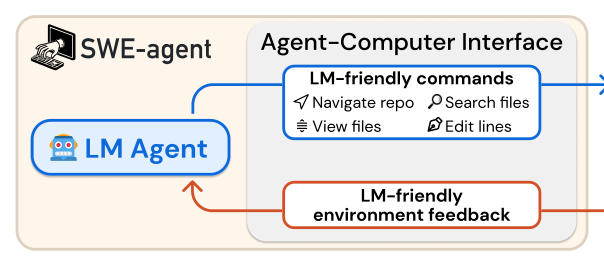
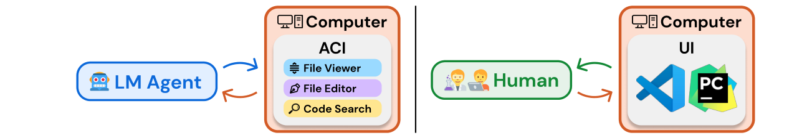
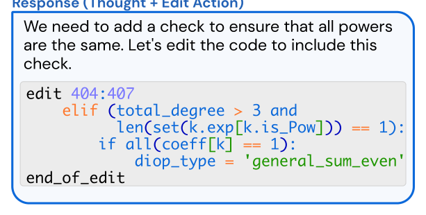
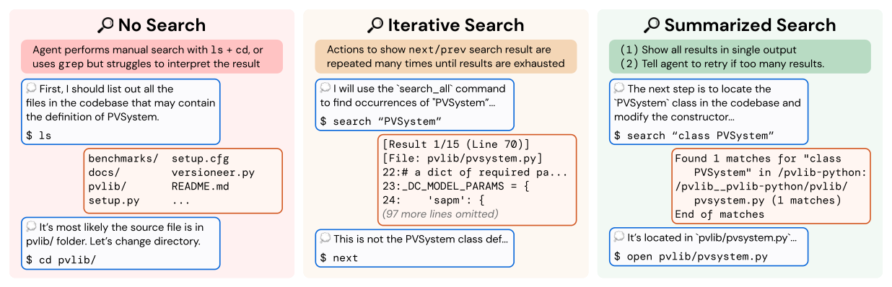
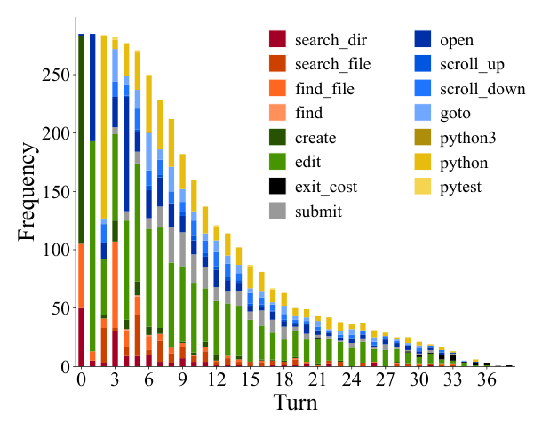

# 《SWE-agent: Agent-Computer Interfaces Enable Automated Software Engineering》深度解读

| 项目 | 内容 |
|---|---|
| 论文标题 | SWE-agent: Agent-Computer Interfaces Enable Automated Software Engineering（智能体-计算机接口使能自动化软件工程） |
| 作者 | **John Yang\***、**Carlos E. Jimenez\***、Alexander Wettig、Kilian Lieret、Shunyu Yao、Karthik Narasimhan、Ofir Press（\*共同一作；通讯 johnby@stanford.edu / carlosej@princeton.edu） |
| 机构 | Princeton Language and Intelligence, Princeton University |
| 发表会议 | NeurIPS 2024（arXiv:2405.15793v3，cs.SE，2024-11-11） |
| 论文链接 | [arXiv](https://arxiv.org/abs/2405.15793) |
| 代码链接 | [GitHub](https://github.com/SWE-agent/SWE-agent)（数据、代码、leaderboard 在 swe-agent.com） |
| 关键词 | Agent-Computer Interface (ACI)、LM Agent、Software Engineering、SWE-bench、Interface Design、Guardrails（护栏）、Context Management（上下文管理）、ReAct |

**摘要（原文）**：

> Language model (LM) agents are increasingly being used to automate complicated tasks in digital environments. Just as humans benefit from powerful software applications, such as integrated development environments, for complex tasks like software engineering, we posit that LM agents represent a new category of end users with their own needs and abilities, and would benefit from specially-built interfaces to the software they use. We investigate how interface design affects the performance of language model agents. As a result of this exploration, we introduce SWE-agent: a system that facilitates LM agents to autonomously use computers to solve software engineering tasks. SWE-agent's custom agent-computer interface (ACI) significantly enhances an agent's ability to create and edit code files, navigate entire repositories, and execute tests and other programs. We evaluate SWE-agent on SWE-bench and HumanEvalFix, achieving state-of-the-art performance on both with a pass@1 rate of 12.5% and 87.7%, respectively, far exceeding the previous state-of-the-art achieved with non-interactive LMs. Finally, we provide insight on how the design of the ACI can impact agents' behavior and performance.

**摘要（中文）**：

> 语言模型（LM）智能体正越来越多地用于自动化数字环境中的复杂任务。正如人类在软件工程等复杂任务中受益于强大的软件应用（如集成开发环境 IDE），我们提出：LM 智能体是一类**新的终端用户**，有其自身的能力与局限，因而会受益于为它们专门构建的软件接口。我们研究**接口设计如何影响语言模型智能体的表现**。由此提出 SWE-agent：一个让 LM 智能体自主使用计算机解决软件工程任务的系统。SWE-agent 定制的**智能体-计算机接口（ACI）**显著增强了智能体创建/编辑代码文件、导航整个仓库、执行测试与程序的能力。我们在 SWE-bench 与 HumanEvalFix 上评测 SWE-agent，两者均取得 SOTA，pass@1 分别为 **12.5%** 与 **87.7%**，远超此前非交互式 LM 的最好水平。最后，我们给出关于"ACI 设计如何影响智能体行为与表现"的洞见。

**TL;DR（太长不想读）**：

> 让 LM 智能体直接用 Linux shell 干软件工程，它会频频翻车：没有好用的"改几行"命令、编辑出错也没反馈、搜索结果是噪声。SWE-agent 的核心主张是——**为 agent 重新设计接口**（ACI），就像 IDE 之于人类。它给 agent 一套极简命令（`find_file`/`search_file`/`search_dir`/`open`/`scroll`/`goto`/`edit`），配代码 linter 护栏与"折叠历史"的上下文管理，并遵循四条设计原则（简单、紧凑、反馈简洁、护栏）。结果：GPT-4 Turbo 在 SWE-bench 全量解 **12.47%**（前 SOTA 3.8%），Lite 18.00%；HumanEvalFix 87.7%。**不改模型权重，只改接口，就能大幅提效**——这是 harness 工程最重要的奠基性证据。

---

## Q: 这篇论文试图解决什么问题？（按照引言逻辑）

**引言论证链（§1）：**

1. **领域现状**：LM 智能体已能用"执行反馈"做代码生成，但把它用到**软件工程**这类更复杂任务仍未被探索。
2. **已有做法的不足**：现有智能体通常直接使用为人类设计的应用（Linux shell、Python 解释器）。但在真实环境中，LM 智能体**难以可靠地行动**——例如 shell **缺少"编辑一小段文件"的简单命令**，且**编辑出错时不给任何反馈**。
3. **类比论证**：人类工程师在复杂任务中受益于 IDE（VSCode 等强大工具）。受 HCI 研究启发——**界面质量显著影响人类表现**——本文追问：LM 智能体是否同样受益于"更好的接口"？
4. **本文要填补的空白**：能否为 LM 智能体设计一层**抽象层（ACI）**，使其在计算机环境中的能力被显著增强？
5. **一句话研究目标**：> 定义并验证"智能体-计算机接口（ACI）"这一概念——证明**不改模型权重、只改接口**，就能大幅提升 LM 智能体在软件工程任务上的表现。

**为什么这个问题此刻重要：** 在 agentic 任务上，模型之外的"接口/运行时"往往比模型本身更能决定成败。SWE-agent 是第一个把这一直觉变成可量化结论（+10.7 个百分点、6.7× 解决率提升）的工作，为后续所有 coding harness（OpenHands、Aider、Claude Code）奠定了设计语言。

---

## Q: 有哪些相关研究？

**① 代码生成 / 交互式编码**
- **InterCode**（Yang et al., 2023）：交互式代码环境，本文 Shell-only 基线即改编自此。
- **CodeAct**（Wang et al., 2024）：以可执行代码为动作空间；SWE-agent 的动作同样以"thought + command"形式呈现（ReAct 风格）。
- **执行反馈式代码生成**（[39] 等）：本文的出发点，但指出其未覆盖软件工程级复杂度。

**② 软件工程基准**
- **SWE-bench**（Jimenez et al., 2024）：2,294 个真实 GitHub issue 任务，本文主评测场。
- **HumanEvalFix**（Muennighoff et al., 2024）：短形式代码调试基准，本文用它测基础编辑能力。

**③ Agent 与接口/HCI**
- **ReAct**（Yao et al., 2022）："推理 + 行动"交错范式，SWE-agent 每步生成 thought + command。
- **HCI 用户研究**（[7] 等）：启发"接口与用户直觉/表现的兼容性"，本文把它类比到 LM 智能体。

**④ 检索增强基线**
- **BM25 RAG**（Jimenez et al., 2024）：非交互式检索增强，直接生成补丁；本文的直接对照。

**定位差异**：以往工作分别探索"工具使用 / 提示技巧 / 代码执行"，SWE-agent **把这些统一到 ACI 框架下**，系统研究接口设计本身的影响。

---

## Q: 论文如何解决这个问题？（额外对提及的算法和框架进行解释，是什么，为什么用，这篇文章怎么用的）

### ① ACI（Agent-Computer Interface）——是什么 / 为什么用 / 怎么用



- **是什么**：LM 智能体与计算机之间的**抽象层**，规定两件事——(a) 智能体可用的命令，(b) 环境状态如何回传给智能体；并负责追踪历史、决定每步如何格式化并拼进模型输入。
- **为什么用**：LM 智能体是"**一类新的终端用户**"，其能力/局限与人类不同——例如当前 LM 缺乏视觉理解，无法直接操作富 GUI；且 LM **无法像人一样忽略无关信息**（所有内容都有 token 成本，干扰性上下文会损害表现）。因此**为人类设计的 UI（如 shell）并不适合 agent**。
- **本文怎么用**：固定 LM，只设计 ACI；通过 (1) 人工检查 agent 行为找痛点、(2) 网格搜索配置，得到四条设计原则（见下）。

### ② 四条 ACI 设计原则（§2）

1. **动作要简单易懂**：bash 命令选项动辄几十个，应提供选项少、文档简洁的命令，减少对示范/微调的依赖。
2. **动作要紧凑高效**：把重要操作（导航、编辑）**合并为尽量少的动作**；反面是"很多小动作需跨多轮组合"。
3. **环境反馈要有信息量但简洁**：告诉 agent 当前状态与最近动作的效果，但去掉冗余。
4. **护栏（guardrails）要能遏制错误传播、加速恢复**：如自动检测语法错误的 linter，帮助 agent 及时发现并纠正错误。



### ③ SWE-agent 的 ACI 组件（§3）

- **搜索与导航**：`find_file`（按文件名搜）、`search_file` / `search_dir`（在文件/目录中搜字符串），输出**摘要式**结果；每次搜索**最多返回 50 条**，超限则不返回结果、提示 agent 写更具体的查询。
- **文件查看器（File Viewer）**：`open` 打开文件，一次最多显示 **100 行**窗口；`scroll_down` / `scroll_up` 移动窗口，`goto` 跳到指定行。窗口显示：完整路径、总行数、前后省略行数、每行行号。



- **文件编辑器（File Editor）**：`edit` 与查看器联动，接收 3 个参数（起始行、结束行、替换文本），**一步替换多行**；编辑后查看器**自动显示更新内容**，无需额外命令。**集成 linter 护栏**：检测语法错误，显示错误前后代码片段，**无效编辑被丢弃并要求重试**。
- **上下文管理**：每步要求生成 **thought + action**（ReAct）；格式错误的生成触发错误提示并重试；**过去 5 条之前的观察各自折叠成一行**，在保留计划/动作历史的同时减少上下文、避免展示过时文件信息；无输出时显示固定提示（"命令成功执行但无输出"）。

### ④ 实验设置（§4）

- **数据**：SWE-bench 全量 2,294；消融用 SWE-bench Lite（300）；另测 HumanEvalFix。
- **模型**：GPT-4 Turbo（128k 上下文）、Claude 3 Opus（200k）；Llama 3（8k）、DeepSeek Coder 等因窗口太小或表现不佳未采用。
- **基线**：(1) 非交互式 RAG（BM25 检索 + 直接生成补丁）；(2) Shell-only（InterCode 式，只用默认 Linux shell）。
- **指标**：% Resolved / pass@1；$ Avg. Cost；单实例预算 $4。

---

## Q: 论文使用的训练数据，结构细节，来源等详细信息（围绕可复现目标）

> SWE-agent 是**方法/系统论文**，不训练模型；其"数据"是评测集与 ACI 配置。

**① 评测数据**

| 数据集 | 规模 | 来源/结构 |
|---|---|---|
| SWE-bench | 2,294 实例 | 12 个流行 Python 仓库的真实 GitHub issue+PR（Jimenez et al., 2024） |
| SWE-bench Lite | 300 实例 | SWE-bench 的自包含功能性 bug 修复子集 |
| HumanEvalFix | Python/JS/Java | 短形式代码调试（Muennighoff et al., 2024） |

**② ACI 配置（可复现关键）**
- **命令集**：`find_file`、`search_file`、`search_dir`、`open`、`scroll_down`、`scroll_up`、`goto`、`edit`，外加 Linux 常用命令。
- **参数**：文件查看窗口 **100 行**；搜索每查询最多 **50 条**；历史处理为"**折叠最后 5 条之前的观察**"；每实例预算 **$4**。
- **配置搜索**：窗口大小、历史处理、解码温度做过 sweep（§B.1）；最终 ACI 由对开发集少量样本的定性分析 + 网格搜索确定。
- **可复现资源**：代码、数据、leaderboard 在 **swe-agent.com**。

**③ 未做训练**：固定 LM 权重，全部提升来自接口设计——这是本文方法论的要点，也意味着**换模型即可迁移**（论文验证了 Claude 3 Opus 上同样有效）。

---

## Q: 论文做了哪些实验？

**主结果（Table 1）**

| 设置 | 模型 | SWE-bench %Resolved | $ Avg Cost | Lite %Resolved | Lite $Avg Cost |
|---|---|---|---|---|---|
| RAG | GPT-4 Turbo | 1.31 | 0.13 | 2.67 | 0.13 |
| RAG | Claude 3 Opus | 3.79 | 0.25 | 4.33 | 0.25 |
| Shell-only | GPT-4 Turbo | − | − | 11.00 | 1.46 |
| Shell-only w/o demo | GPT-4 Turbo | − | − | 7.33 | 0.79 |
| **SWE-agent** | **GPT-4 Turbo** | **12.47** | 1.59 | **18.00** | 1.67 |
| **SWE-agent** | **Claude 3 Opus** | **10.46** | 2.59 | **13.00** | 2.18 |

> 结论：SWE-agent + GPT-4 Turbo 全量解 **12.47%（286/2,294）**，Lite **18.00%（54/300）**；相对 Shell-only 提升 **+64% 相对 / +10.7 百分点**；相对 RAG 解决率提升 **6.7×**（代价是 8–13× 成本）。

**HumanEvalFix（Table 2）**

| 模型 | Python | JS | Java |
|---|---|---|---|
| GPT-4 | 47.0 | 48.2 | 50.0 |
| DeepseekCoder-CodeAlpaca-6.7B | 49.4 | 51.8 | 45.1 |
| WaveCoder-DS-6.7B | 57.9 | 52.4 | 57.3 |
| **SWE-agent w/ GPT-4 Turbo** | **87.7** | **89.7** | **87.9** |

**ACI 消融（Table 3，SWE-bench Lite，GPT-4 Turbo）**

| 维度 | 设置 | %Resolved | Δ |
|---|---|---|---|
| Editor | `edit` action | 15.0 | −3.0 |
| Editor | `edit` + linting | **18.0** | 基准 |
| Editor | No edit | 10.3 | −7.7 |
| Search | Summarized | **18.0** | 基准 |
| Search | Iterative | 12.0 | −6.0 |
| Search | No search | 15.7 | −2.3 |
| File Viewer | 30 lines | 14.3 | −3.7 |
| File Viewer | 100 lines | **18.0** | 基准 |
| File Viewer | Full file | 12.7 | −5.3 |
| Context | Last 5 Obs. | **18.0** | 基准 |
| Context | Full history | 15.0 | −3.0 |
| Context | w/o demo | 16.3 | −1.7 |



**关键发现**
- **为人类设计的 UI 不一定适合 agent**：链式 `cd`/`ls`/`cat` 极低效；`grep`/`find` 常产生大量无关结果。
- **"迭代式搜索"反而比没有搜索更差**（12.0% vs 15.7%）：agent 会**逐条穷举所有匹配**，耗尽预算/上下文。→ 支持"摘要式搜索 + 超限提示重试"的设计。
- **紧凑的编辑接口至关重要**：无 `edit` 时只能用重定向/sed，低效易错（10.3%）。
- **文件查看窗口**：100 行最优；全文件（12.7%）与 30 行（14.3%）都更差。
- **上下文管理**：折叠旧观察（18.0%）优于保留全历史（15.0%）。



**其他分析（§5、附录）**
- Pass@k：6 次运行的方差较低，但**单实例的解决与否可能大幅波动**（Fig. 4）。
- 成功率与 issue 年龄**无关**（控制潜在测试污染，§B.2）。

---

## Q: 这篇论文的创新点和可以借鉴的地方

**真创新（概念级）**
1. **提出 ACI 概念**：把"为 agent 重新设计计算机接口"确立为一等研究对象，类比 IDE 之于人类。
2. **证明"不改权重、只改接口"能大幅提效**：+10.7 个百分点、6.7× 解决率——harness 工程最重要的奠基证据。
3. **四条可操作的 ACI 设计原则**（简单、紧凑、反馈简洁、护栏）。
4. **接口设计的系统性消融**：搜索（summarized vs iterative vs none）、编辑（edit vs no edit）、查看窗口、上下文管理——把"接口选择"变成可测量的变量。
5. **开源 SWE-agent**：成为后续 coding harness 的参考实现与基线。

**可借鉴的工程技巧**
- 用**摘要式搜索 + 超限提示重试**，避免 agent 穷举结果（一个反直觉但关键的发现）。
- 把编辑与查看器**集成**：编辑后自动刷新视图，省一轮交互。
- 用 **linter 护栏**自动拦截语法错误并丢弃无效编辑。
- **折叠旧观察**（保留计划/动作历史、去掉过时文件内容）来控制上下文。
- 搜索/查看/编辑**各自合并为少量强动作**，而非"很多小动作跨轮组合"。

---

## Q: 这篇论文有哪些不足

1. **依赖强模型与长上下文**：仅 GPT-4 Turbo / Claude 3 Opus 可用；Llama 3（8k）等小窗口模型表现不佳——**ACI 的收益依赖足够大的上下文预算**。
2. **成本高**：Lite 上单实例 $1.67，相对 RAG 高 8–13×；$4 预算截断可能低估上限。
3. **绝对成功率仍低**：全量 12.47% 意味着绝大多数真实 issue 仍无法解决。
4. **仅 Python / SWE-bench**：泛化到其他语言、其他仓库类型未知。
5. **ACI 需人工设计与网格搜索**：配置依赖人工检查与 sweep，自动化程度有限。
6. **继承 SWE-bench 的评测局限**：依赖仓库测试，通过测试 ≠ 工程质量。
7. **单实例方差大**：同一实例多次运行结果可能不同，评测需多次运行取平均。

---

## Q: 提炼论文的一般技术和逻辑范式

**范式：把"接口"当作可优化的变量，而非既定约束**

```
固定模型权重 → 设计 ACI(动作+反馈+历史管理+护栏) → 消融验证每个设计选择 → 得设计原则
```

可复用的方法论：
1. **为 agent（而非人类）设计接口**：考虑 agent 的能力/局限（无视觉、上下文有成本、易被干扰）。
2. **动作要少而强**：合并跨轮操作，降低组合错误。
3. **反馈要"够用但不过量"**：告诉效果、去掉冗余。
4. **护栏内建于动作**：让错误在发生处被拦截，而非传播。
5. **上下文要主动管理**：折叠历史、避免过时信息。
6. **用消融证明设计**：每个接口选择都要有对照实验支撑。

**隐含假设**：① LM 的能力足够但被接口限制；② 人类 UI 的最优 ≠ agent 的最优；③ 上下文/预算是稀缺资源；④ SWE-bench 测试能代表软件工程能力。

---

## Q: 针对这篇文章，思考有哪些值得做的研究话题

**研究主题**

- **上位类研究**：Agent-Computer Interface / agent 运行时（harness）设计——"模型之外的接口如何决定 agent 能力上限"。
- **同位类研究**：与 SWE-agent 平行的 coding harness（OpenHands、Aider、Claude Code、Codex CLI、AutoCodeRover、Agentless）及"交互式 agent vs 非交互式流水线"路线之争。
- **下位类研究**：
  - **搜索/编辑接口**的自动设计与学习；
  - **护栏与错误恢复**机制（linter、类型检查、测试驱动）；
  - **上下文/历史管理**策略（折叠、压缩、检索式回放）；
  - **跨模型可移植性**与接口-模型协同设计；
  - **ACI 的自动搜索/优化**（替代人工网格搜索）；
  - **成本-性能权衡**与预算感知的 agent 调度。

**数据类型**：
- Agent 交互轨迹（thought + command + observation）；
- 各接口变体下的成功率/成本对照数据；
- 代码仓库快照与测试（SWE-bench 类）；
- 失败模式标注（用于分析接口缺陷）。

**研究设计**：
- **控制变量**：固定模型，逐个替换接口组件（搜索/编辑/查看窗口/上下文管理/护栏），测量边际收益；
- **对照**：Shell-only、RAG、各接口变体；
- **指标**：%Resolved、pass@k、$Cost、步数、失败模式分布；
- **预期贡献**：提炼"接口设计原则"并给出可自动化的接口搜索方法。

---

<!-- 图表来源：Fig.1 ACI 总览、Fig.3 文件查看器与编辑、Fig.5 三种搜索接口、Fig.8 失败模式分布，均由原 PDF 裁剪（220 DPI）。 -->
