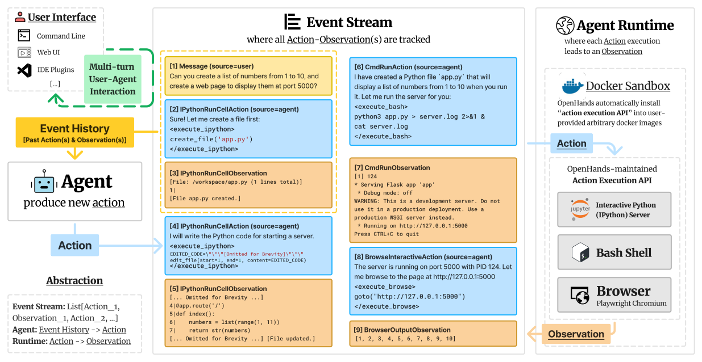
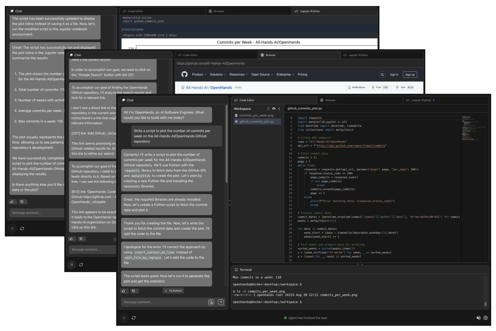
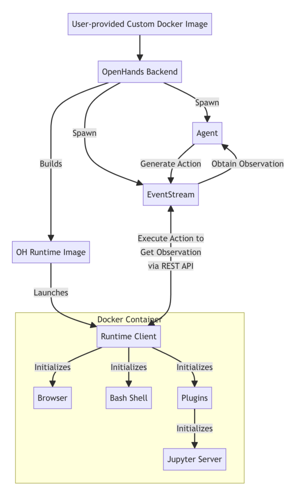
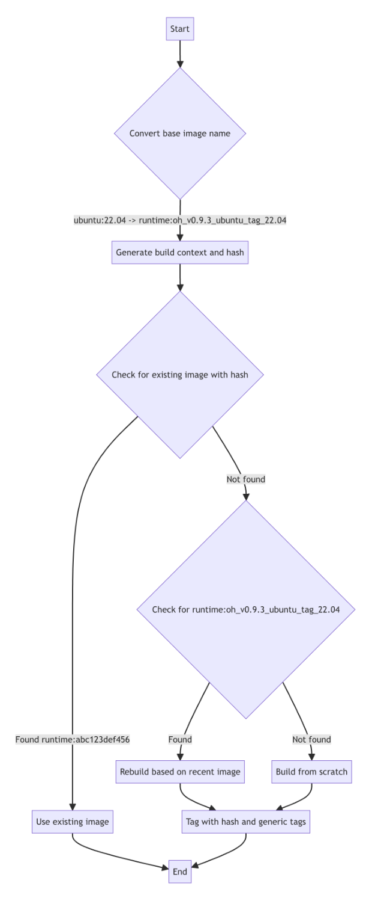

# 《OpenHands: An Open Platform for AI Software Developers as Generalist Agents》深度解读

| 项目 | 内容 |
|---|---|
| 论文标题 | OpenHands: An Open Platform for AI Software Developers as Generalist Agents（面向通用智能体的开源 AI 软件开发者平台） |
| 作者 | **Xingyao Wang**、Boxuan Li、Yufan Song、Frank F. Xu、Xiangru Tang、Mingchen Zhuge、Jiayi Pan、Yueqi Song、Bowen Li、Jaskirat Singh、Hoang H. Tran、Fuqiang Li、Ren Ma、Mingzhang Zheng、Bill Qian、Yanjun Shao、Niklas Muennighoff、Yizhe Zhang、Binyuan Hui、Junyang Lin、Robert Brennan、Hao Peng、Heng Ji、**Graham Neubig**（通讯，gneubig@cs.cmu.edu） |
| 机构 | UIUC、CMU、Yale、UC Berkeley、Contextual AI、KAUST、ANU、HCMUT、Alibaba、All Hands AI |
| 发表会议 | ICLR 2025（arXiv:2407.16741v3，cs.SE，2025-04-18） |
| 论文链接 | [arXiv](https://arxiv.org/abs/2407.16741) |
| 代码链接 | [GitHub](https://github.com/All-Hands-AI/OpenHands)（MIT 许可） |
| 关键词 | Agent Platform（智能体平台）、Event Stream（事件流）、Docker Sandbox（沙箱运行时）、CodeAct、AgentSkills（可扩展 ACI）、Multi-Agent Delegation（多智能体委派）、Evaluation Framework（评测框架） |

**摘要（原文）**：

> Software is one of the most powerful tools that we humans have at our disposal; it allows a skilled programmer to interact with the world in complex and profound ways. At the same time, thanks to improvements in large language models (LLMs), there has also been a rapid development in AI agents that interact with and affect change in their surrounding environments. In this paper, we introduce OpenHands (f.k.a. OpenDevin), a platform for the development of powerful and flexible AI agents that interact with the world in similar ways to those of a human developer: by writing code, interacting with a command line, and browsing the web. We describe how the platform allows for the implementation of new agents, safe interaction with sandboxed environments for code execution, coordination between multiple agents, and incorporation of evaluation benchmarks. Based on our currently incorporated benchmarks, we perform an evaluation of agents over 15 challenging tasks, including software engineering (e.g., SWE-BENCH) and web browsing (e.g., WEBARENA), among others. Released under the permissive MIT license, OpenHands is a community project spanning academia and industry with more than 2.1K contributions from over 188 contributors.

**摘要（中文）**：

> 软件是人类所拥有的最强大的工具之一；它让熟练的程序员能够以复杂而深刻的方式与世界交互。与此同时，得益于大语言模型（LLM）的进步，能够感知外部环境并对其施加改变的 AI 智能体（AI agents）也在快速发展。本文提出 OpenHands（曾用名 OpenDevin）：一个用于开发强大而灵活的 AI 智能体的平台，这些智能体以与人类开发者相似的方式与世界交互——通过写代码、使用命令行、浏览网页。我们描述了该平台如何支持：实现新的智能体、在沙箱环境中安全地执行代码、多个智能体之间的协作、以及集成评测基准。基于目前已集成的基准，我们在 15 个挑战性任务上对智能体进行了评测，涵盖软件工程（如 SWE-BENCH）与网页浏览（如 WEBARENA）等。OpenHands 以宽松的 MIT 许可发布，是一个横跨学术界与工业界的社区项目，拥有来自 188+ 位贡献者的 2.1K+ 次贡献。

**TL;DR（太长不想读）**：

> Devin 证明了"AI 软件工程师"可行，但它完全闭源，学界无法研究其 harness 内部设计。OpenHands 把这件事开源了：用**事件流（Event Stream）**把 agent 循环与执行环境解耦，用**每个会话一个 Docker 沙箱**承载 bash / IPython / 浏览器三类动作，用 **AgentSkills** 把 SWE-agent/Aider 的文件编辑等专用接口沉淀为可复用工具，用 **AgentDelegateAction** 支持多智能体委派，并内置 **15 个评测基准**形成闭环。其默认 CodeActAgent 在 SWE-bench Lite 上达到 26%（claude-3.5-sonnet），且同一个 agent 不改 prompt 就能跨软件工程、网页、通用问答三类任务取得有竞争力的成绩。它是当前研究"harness 各组件如何组织"最完整的公开标本。

---

## Q: 这篇论文试图解决什么问题？（按照引言逻辑）

**引言论证链（§1）：**

1. **领域现状**：LLM 驱动的 AI 智能体正快速走向复杂任务——开发软件（Jimenez et al., 2024）、导航真实网站（Zhou et al., 2023a）、做家务（Ahn et al., 2022）、甚至做科研（Boiko et al., 2023; Tang et al., 2024a）。
2. **已有开源框架的不足**：AutoGPT、LangChain、MetaGPT、AutoGen 等框架通常只覆盖三件事——① agent 与世界的交互接口（JSON 函数调用或代码执行）、② agent 运行的环境、③ 人-agent 或 agent-agent 的交互机制（Tab. 1、§C）。但它们普遍缺失：
   - **没有安全的代码执行沙箱**（多数框架不内置 sandbox & code execution）；
   - **没有内置网页浏览器**；
   - **没有系统化评测框架**（Evaluation Framework）；
   - **缺少可复用的标准化工具库**与**多智能体协作**的一等支持。
3. **本文要填补的空白**：能否构建一个**完整、开箱即用**的平台，同时具备：安全沙箱运行时 + 可插拔 agent 架构 + 可复用技能库 + 多 agent 委派 + 与评测基准的闭环集成？
4. **一句话研究目标**：> 让 agent 像人类开发者一样，通过"写代码 / 命令行 / 浏览网页"与世界交互，并把承载这一切的运行时（harness）以开源、可复现的方式提供给社区。

**为什么这个问题此刻重要：** 当 agent 开始承担软件工程这类高风险、长程、需要执行反馈的任务时，"模型之外的整个运行时系统"（即 harness）就成了决定成败的关键。而当时唯一达到产品级表现的 Devin 是闭源的，社区**缺乏一个可研究、可复现、可比较的公开标本**——OpenHands 正是为填补这个方法论空缺而生。

---

## Q: 有哪些相关研究？

按技术脉络分组：

**① 通用 Agent 框架（竞争/对照对象，见 Tab. 1、§C）**
- **AutoGPT**（Significant Gravitas, 2023）：自主 GPT-4 循环，但无内置沙箱/浏览器/评测。
- **LangChain**（Chase, 2022）：通用编排框架，工具与记忆抽象丰富，但沙箱与浏览器为第三方商业方案。
- **MetaGPT**（Hong et al., 2023）：多 agent 协作（SOP 式），多智能体支持强，但缺内置沙箱。
- **AutoGen**（Wu et al., 2023）：多 agent 对话框架，支持多 agent 协作，但同样缺沙箱/浏览器。
- **AutoAgents**（Chen et al., 2024）、**Xagents**（Team, 2023）、**OpenAgents**（Xie et al., 2023）、**GPTSwarm**（Zhuge et al., 2024）。

**② 软件工程（SWE）专用 Agent（直接对手）**
- **SWE-agent**（Yang et al., 2024）：提出 ACI（Agent-Computer Interface），OpenHands 的 `AgentSkills`（edit_file 等）直接改编自它。
- **AutoCodeRover**（Zhang et al., 2024b）：SWE 专用，SWE-bench Lite 19.0%。
- **Agentless**（Xia et al., 2024）：非 agent 式的"定位-修复"流水线，gpt-4o 达 27.3%（当时很强）。
- **Aider**（Gauthier）：终端配对编程，SWE-bench Lite 26.3%；OpenHands 的 edit 技能亦参考它。

**③ Web Agent / 环境**
- **WebArena**（Zhou et al., 2023a）：可自托管、执行式评测的 web agent 基准（812 任务），OpenHands 的 BrowsingAgent 与之对标。
- **MiniWoB++**（Liu et al., 2018）：125 个合成极简网页环境。
- **WorkArena**（Drouin et al., 2024）：提供 BrowserGym 的观测/动作空间，OpenHands 的 `BrowserInteractiveAction` 直接采用其 DSL。

**④ 方法论/组件来源**
- **CodeAct**（Wang et al., 2024a）：以"可执行代码作为动作空间"的核心思想，是 CodeActAgent 的基础。
- **MINT**（Wang et al., 2024b）、**AgentBench**（Liu et al., 2023）、**GAIA**（Mialon et al., 2023）、**GPQA**（Rein et al., 2023）等评测集。

**边界**：与上述工作相比，OpenHands 的差异不在于单个组件更优，而在于**把"沙箱运行时 + 可插拔 agent + 技能库 + 多 agent + 评测"整合为一个可复现的开源整体**。

---

## Q: 论文如何解决这个问题？（额外对提及的算法和框架进行解释，是什么，为什么用，这篇文章怎么用的）

### 总览：Agent / Event Stream / Runtime 三位一体



OpenHands 把系统切成三层（Fig. 2）：**Agent**（产生动作）↔ **Event Stream**（记录历史、解耦）↔ **Runtime**（执行动作、回传观察）。

### ① 事件流（Event Stream）——是什么 / 为什么用 / 怎么用

- **是什么**：一个按时间排列的 Action 与 Observation 集合，是 agent 状态的**核心组件**。形式化地，`Event Stream: List[Action_1, Observation_1, Action_2, ...]`。
- **为什么用**：它把"agent 循环"与"环境执行"**解耦**——agent 只面对事件流读写，不直接接触沙箱；沙箱崩溃/重启不影响 agent 逻辑；同一 agent 可对接不同 runtime；同时天然支持**轨迹回放**（可审计、可复现）。
- **本文怎么用**：`State` 数据结构封装事件流 + 累计 LLM 成本 + 多 agent 委派元数据等；`Agent.step(state)` 读取事件流生成下一个 Action（Fig. 3）。

### ② Agent 抽象与动作空间（CodeAct 思想）



- **是什么（CodeAct）**：由 Wang et al. (2024a) 提出，用**可执行代码**（而非固定 JSON 工具调用）作为 agent 的动作空间。
- **为什么用**：编程语言（PL）动作空间**表达力强**（可组合、可 `if/for`、可调库）、**可靠且易维护**——无需为每个工具重训/重写接口。
- **本文怎么用**：核心动作为
  - `IPythonRunCellAction`：在沙箱内执行任意 Python；
  - `CmdRunAction`：执行任意 bash 命令；
  - `BrowserInteractiveAction`：用 BrowserGym 的浏览 DSL 操作浏览器（导航/点击/输入/滚动）；
  - `AgentDelegateAction`：委派子任务给其他 agent；
  - `AgentFinishAction` / `MessageAction`：结束或与人对话。
  - 论文给出最小 agent 实现（Fig. 3）：`step()` 拼接 system message + 历史消息 → 调 LLM → 解析出 action 类型 → 返回对应 Action。该设计**兼容传统 function-calling**（可把 Python 函数包装成 JSON 工具）。

### ③ Runtime：执行动作 → 产生观察



- **是什么**：一个**每个任务会话独立启动的 Docker 容器沙箱**，内含三类服务。
- **为什么用**：安全隔离——agent 的破坏性/不可逆操作被限制在沙箱内；同时提供与人类开发者等价的动作空间（终端 + Jupyter + 浏览器）。
- **本文怎么用（Docker Sandbox + Action Execution API）**：
  - 容器内运行 **OpenHands Action Execution API（REST server）**，监听事件流发来的执行请求；
  - API 维护：**(1) bash shell**（连操作系统）、**(2) Jupyter IPython server**（交互式 Python）、**(3) 基于 Playwright 的 Chromium 浏览器**（提供导航/点击/输入/滚动等 BrowserGym 动作原语，回传 HTML、DOM、accessibility tree、截图、标签页等观察）；
  - 用户工作目录以 volume 挂载进沙箱；
  - **任意 Docker 镜像支持**：OpenHands 有 build 机制，把 action execution API 自动安装进用户提供的任意镜像，从而支持不同 OS/软件环境。



### ④ AgentSkills：可扩展的 ACI（§2.3）

- **是什么**：一个 Python 包形式的**工具箱**，函数被自动 import 进 Jupyter IPython 环境。
- **为什么用**：SWE-agent 证明了精心设计的 ACI（专用工具）对复杂任务至关重要；但**逐个维护/分发大量工具是工程负担**。用 Python 包统一承载，可让不同 agent 实现共享同一套工具。
- **本文怎么用（收录哲学）**：**只**收录满足以下之一的新技能——(1) LLM 难以直接写代码实现的（如按行编辑文件），或 (2) 需要调用外部模型的（如语音转文字、代码编辑模型）。当前包含：改编自 SWE-agent / Aider 的 `edit_file`（按指定行修改文件）、`scroll_up` / `scroll_down`（查看文件不同部分）、`parse_image` / `parse_pdf`（用 VLM 解析图片、读 PDF 文本）。

### ⑤ 多智能体委派（§2.4）

- **是什么**：`AgentDelegateAction`——一个 agent 把特定子任务委派给另一个 agent。
- **为什么用**：让通用 agent 与专项 agent 协作，兼顾通用性与专业性。
- **本文怎么用**：通用 `CodeActAgent` 网页能力有限，可把复杂浏览任务委派给专项 `BrowsingAgent`（导航、点击、提交表单等）。

### ⑥ AgentHub（§3）：社区贡献的 agent 集合

- **CodeActAgent**：默认通用 agent（基于 CodeAct），每步可对话澄清或执行代码（bash/Python/浏览器 PL）。
- **Browsing Agent**：通用 web agent，零样本提示，观测/动作优于 WebArena 原版。
- **GPTSwarm Agent**：用可优化图（节点=操作，边=协作）构建 agent 系统，可自动优化拓扑。
- **Micro Agent**：面向特定任务的微 agent，复用通用 agent 大部分实现，仅共享专用 prompt，降低开发门槛。

---

## Q: 论文使用的训练数据，结构细节，来源等详细信息（围绕可复现目标）

> 注意：OpenHands 是**平台类论文**，其"数据"主要是**评测基准 + 运行时镜像 + 配置**，而非训练语料。以下按可复现维度列出。

**① 评测基准（15 个，Tab. 2）**

| 类别 | 基准 | 能力要求 | 规模（论文所用） |
|---|---|---|---|
| 软件工程 | SWE-Bench (Jimenez et al., 2024) | 修复 GitHub issue | 全量 2,294 实例；论文默认用 SWE-bench Lite 300 实例（无 hint） |
| 软件工程 | HumanEvalFix (Muennighoff et al., 2024) | 修 Bug | Python split 164 实例 |
| 软件工程 | BIRD (Li et al., 2023b) | Text-to-SQL | 从 dev set 选 300 样本 |
| 软件工程 | BioCoder (Tang et al., 2024c) | 生物信息学编码 | 157 Python（+50 Java） |
| 软件工程 | ML-Bench (Tang et al., 2024b) | 机器学习编码 | 9,641 任务 / 169 问题 / 18 仓库；评测用 1/4 子集（68 实例） |
| 软件工程 | Gorilla APIBench (Patil et al., 2023) | API 调用 | 1,775 实例（TorchHub/TensorHub/HuggingFace） |
| 软件工程 | ToolQA (Zhuang et al., 2024) | 工具使用 | 800 实例；用 easy 子集 |
| 网页 | WebArena (Zhou et al., 2023a) | 目标规划 + 真实浏览 | 812 条人工指令 |
| 网页 | MiniWoB++ (Liu et al., 2018) | 合成网页短轨迹 | 125 个环境 |
| 综合 | GAIA (Mialon et al., 2023) | 工具使用/浏览/多模态 | 466 任务；用 L1 validation 53 实例 |
| 综合 | GPQA (Rein et al., 2023) | 研究生级问答 | diamond set 198 实例 |
| 综合 | AgentBench (Liu et al., 2023) | OS（bash）交互 | OS 子集 144 实例 |
| 综合 | MINT (Wang et al., 2024b) | 多轮数学/代码 | math 225 / code 136 实例 |
| 综合 | Entity Deduction Arena (Zhang et al., 2024a) | 状态跟踪/策略规划 | Things + Celebrities 各 100，取平均 |
| 综合 | ProofWriter (Tafjord et al., 2021) | 演绎逻辑推理 | 600 实例（5-hop） |

**② 运行时与配置（可复现关键）**
- **沙箱**：每任务会话一个 Docker 容器；容器内运行 OpenHands Action Execution API（bash + Jupyter IPython + Playwright Chromium）。
- **任意镜像支持**：OpenHands 自动把 action execution API 安装进用户提供的任意 docker 镜像（Fig. 5 的 build 流程）。
- **工作区**：用户工作目录以可配置 volume 挂载进沙箱。
- **成本参考**：全量 SWE-bench 2,294 实例约 $6.9k（按 $3/实例保守估计）；SWE-bench Lite 上 CodeActAgent v1.8 平均成本 $1.10/实例（claude-3.5-sonnet）。
- **许可**：MIT（允许商用）。
- **社区规模**：32K GitHub stars、2.1K+ contributions、188+ contributors。

**③ 数据来源与划分**
- 所有评测基准均为**已有公开基准**，OpenHands 负责**集成**而非新建数据集；SWE-bench 全量/ Lite 的划分沿用原论文。
- 论文明确：所有 SWE-bench 结果**不使用 hint text**。

---

## Q: 论文做了哪些实验？

**实验设置**
- 目标：验证"同一个通用 agent 在不改 system prompt 的前提下，跨软件工程、网页、综合任务的表现"。
- 基线：SWE 专用（SWE-Agent、AutoCodeRover、Aider、Moatless Tools、Agentless）、网页专用（Lemur、AutoWebGLM、Auto Eval & Refine、WebArena Agent）、综合（AutoGPT、few-shot CoT 等）。
- 评测：成功率为主要指标，附平均成本。

**主结果（Tab. 3 精选）**

| 类别 | Agent | 模型 | SWE-Bench Lite | WebArena | GPQA |
|---|---|---|---|---|---|
| SWE 专用 | SWE-Agent | gpt-4-1106-preview | 18.0 | − | − |
| SWE 专用 | AutoCodeRover | gpt-4-0125-preview | 19.0 | − | − |
| SWE 专用 | Aider | gpt-4o & claude-3-opus | 26.3 | − | − |
| SWE 专用 | Moatless Tools | claude-3.5-sonnet | 26.7 | − | − |
| SWE 专用 | Agentless | gpt-4o | 27.3 | − | − |
| 网页专用 | Auto Eval & Refine | GPT-4 + Reflexion w/ GPT-4V | − | 20.2 | − |
| **通用** | **OH CodeActAgent v1.8** | **gpt-4o-mini** | **6.3** | **8.3** | − |
| **通用** | **OH CodeActAgent v1.8** | **gpt-4o-2024-05-13** | **22.0** | **14.5** | *53.1 |
| **通用** | **OH CodeActAgent v1.8** | **claude-3-5-sonnet** | **26.0** | **15.3** | 52.0 |
| 通用 | GPTSwarm v1.0 | gpt-4o-2024-05-13 | − | − | − |

> 结论：同一个 CodeAct agent 未做任何 prompt 特化，就在三个大类上取得有竞争力的成绩——这正是"通用性"的论据。

**软件工程细分（Tab. 4，节选）**
- SWE-bench Lite（300 实例，无 hint）：OH CodeActAgent v1.8 + claude-3.5-sonnet = **26.0%**（$1.10/实例）；+ gpt-4o = 22.0%（$1.72）；+ gpt-4o-mini = 7.0%（$0.01）。
- HumanEvalFix（164 实例）：OH CodeActAgent v1.5，0-shot，gpt-4o = **79.3%**（对比 SWE-agent 1-shot 87.7%；BLOOMZ-176B 16.6%、StarCoder2-15B 48.6%）。论文强调 OpenHands 是 0-shot。
- BIRD：OH v1.5 + gpt-4o = **47.3%**。
- ML-Bench（68 实例）：OH v1.5 + gpt-4o = **76.5%**（对比 Aider 64.4%、SWE-Agent 42.6%）。
- BioCoder（157 实例）：OH v1.5 + gpt-4o = **27.5%**。
- Gorilla APIBench（1,775 实例）：OH v1.5 + gpt-4o = 36.4%。
- ToolQA（800 实例，easy）：OH v1.5 + gpt-4o = **47.2%**。

**网页（Tab. 5，节选）**
- WebArena（812 实例）：OH BrowsingAgent v1.0 + claude-3.5-sonnet = **15.5%**；CodeActAgent v1.8 经委派 = 15.3%。
- MiniWoB++（125 环境）：OH BrowsingAgent v1.0 + gpt-4o = **40.8%**；CodeActAgent 经委派 = 39.8%。

**综合（Tab. 6，节选）**
- GAIA L1（53 实例）：OH GPTSwarm v1.0 + gpt-4o = **32.1%**（AutoGPT 13.2%）。
- GPQA diamond（198）：OH CodeActAgent v1.8 + claude-3.5-sonnet = **52.0%**（专家人类 81.3%，非专家 21.9%，gpt-4 CoT 38.8%）。
- AgentBench OS（144）：OH v1.5 + gpt-4o = **57.6%**（基线 gpt-4 42.4%）。
- MINT math（225）：OH v1.5 + gpt-4o = **77.3%**。
- MINT code（136）：OH v1.5 + gpt-4o = 50.0%（基线 gpt-4 59.6%，此处略低）。
- ProofWriter（600）：OH v1.5 + gpt-4o = 78.8%（Logic-LM 79.6%）。
- Entity Deduction Arena（200）：OH v1.5 + gpt-4o = 38.0%（基线 40.0%）。

**消融/工程观察**
- 论文以**跨类别通用性**替代传统消融；关键工程结论包括：事件流解耦带来可回放性、AgentSkills 让不同 agent 共享工具、`AgentDelegateAction` 使通用 agent 借助专项 agent 提升网页任务表现。

---

## Q: 这篇论文的创新点和可以借鉴的地方

**真创新（范式级）**
1. **事件流作为 agent-环境解耦层**：把"动作-观察"历史提升为一等抽象，同时承载状态、成本、委派元数据——这是 OpenHands 区别于"agent 直接调工具"框架的核心架构决策。
2. **通用性优先的评测观**：不追求单一基准 SOTA，而是用**同一个 agent + 同一 prompt**横跨 SWE/Web/综合三类，论证"通用数字 agent"的可行性。
3. **任意 Docker 镜像 + 自动注入 action execution API**：让沙箱环境可插拔（Fig. 5），解决了"agent 只能在固定环境跑"的问题。
4. **AgentSkills 的收录哲学**（只收"LLM 难直接写"或"需外部模型"的工具）——一条可操作的 ACI 设计准则。
5. **可复现的开源平台标本**：MIT 许可 + 15 基准集成 + 社区规模，使其成为 harness 研究的事实参照物。

**可借鉴的工程技巧**
- 用 `State` 同时携带事件流、成本、委派元数据——把"上下文预算"变成显式状态。
- 用 PL（代码）作为统一动作空间，同时保留 function-calling 兼容层（把 Python 函数包装成 JSON 工具）。
- 用 `AgentDelegateAction` 做"通用 agent + 专项 agent"的编排，而非把一切塞进一个 prompt。
- 每会话独立沙箱 + 事件流通信：崩溃可重启、轨迹可回放。
- Micro Agent 模式：复用通用实现、只换 prompt，降低社区贡献门槛。

---

## Q: 这篇论文有哪些不足

1. **成本高、规模化难**：每会话一个完整 Docker 环境，内存/磁盘占用大；全量 SWE-bench 约 $6.9k，Lite 上单实例仍需 $1+（claude/gpt-4o 档）。
2. **系统复杂度高**：事件流 + REST API + 多服务（bash/Jupyter/Playwright）抽象层多，上手与调试曲线陡。
3. **并非各基准最优**：SWE-bench Lite 26% 低于 Agentless 27.3%；MINT code（50.0%）低于基线 gpt-4（59.6%）；ProofWriter、EDA 亦略低于最强基线——"通用"以牺牲单点最优为代价。
4. **评测锁定风险**：长期主攻 SWE-bench/WebArena 等既有基准，"高分"是否等价于"任意真实开发任务可泛化"仍需验证。
5. **安全边界**：论文自述面临"开发安全可靠 agent 的挑战"（§A）；代码即动作的灵活性需要更强权限控制，沙箱是底线而非全部。
6. **与商业系统差距**：Devin/Claude Code 等闭源系统的专有 harness 细节（上下文压缩、工具打磨）仍是黑盒优势；开源可复现 ≠ 效果最优。
7. **平台 vs 产品的张力**：面向研究者的高可配置性（大量选项）与产品化易用性之间存在矛盾。

---

## Q: 提炼论文的一般技术和逻辑范式

**范式：把"agent 能力"拆成 harness 的五层，并用事件流把它们串起来**

```
Agent(策略) --Action--> Event Stream --执行--> Runtime(沙箱) --Observation--> Event Stream --读取--> Agent
```

可复用的方法论：
1. **解耦原则**：策略（agent）与执行（runtime）通过**事件流**解耦——带来可回放、可替换、可隔离。
2. **动作空间即语言**：用代码（PL）作为统一动作空间，表达力/可靠性/可维护性兼得；同时兼容结构化工具调用。
3. **环境即镜像**：把运行环境抽象为 Docker 镜像 + 注入式 API，实现"环境可插拔"。
4. **技能沉淀**：只把"LLM 难写或需外部模型"的能力固化为工具，其余交给通用代码生成。
5. **编排分层**：通用 agent 处理主流程，专项 agent 处理子领域，用委派动作连接。
6. **评测内建**：把 benchmark 集成进平台，形成"评测驱动 harness 迭代"的闭环。

**隐含假设**：① 任务可被"动作-观察"序列建模；② 沙箱足以隔离风险；③ 更强模型 + 同一 harness 会单调变好；④ 已有基准能代表真实能力边界。

---

## Q: 针对这篇文章，思考有哪些值得做的研究话题

**研究主题**

- **上位类研究**：通用数字智能体（generalist digital agents）/ Agentic AI 的运行时与系统架构研究——即"模型之外的 harness 如何决定 agent 能力上限"。
- **同位类研究**：与 OpenHands 平行的 agent 平台/框架研究（AutoGen、MetaGPT、LangGraph、Agentless、SWE-agent、Devika、Aider），以及"平台 vs 专用 agent"的路线之争。
- **下位类研究**：
  - 事件流的状态表示与**上下文压缩（compaction）**策略；
  - ACI/AgentSkills 的**工具设计与自动发现**；
  - 多 agent 委派的**调度与信用分配**；
  - 沙箱**安全**与间接提示注入防御；
  - harness 与 RLVR 的闭环（用轨迹做可验证奖励训练）。

**数据类型**：
- Agent 运行轨迹（Action-Observation 序列、成本、终止原因）——OpenHands 天然产出；
- 真实 GitHub issue/PR + 测试（SWE-bench 类）；
- 网页交互轨迹（DOM/a11y/截图 + 动作）；
- 需要人工标注的"环境-任务"对（初始状态配置 + 执行式评测脚本）。

**研究设计**：
- **控制变量**：固定模型，仅替换 harness 组件（事件流 vs 直接调用、有无 compaction、ACI 变体），观察成功率/成本变化；
- **对照**：OpenHands 默认 vs 去掉某组件（消融），并与 Agentless/SWE-agent 对比；
- **指标**：任务成功率、单任务成本、步数、失败模式分布、可复现性（同 seed 方差）；
- **预期贡献**：量化"harness 组件的边际收益"，为"何时该换模型、何时该改 harness"提供经验规律。

---

<!-- 图表来源：Fig.1 UI、Fig.2 三组件架构、Fig.4 runtime workflow、Fig.5 runtime image build workflow，均由原 PDF 裁剪（220 DPI）。 -->
