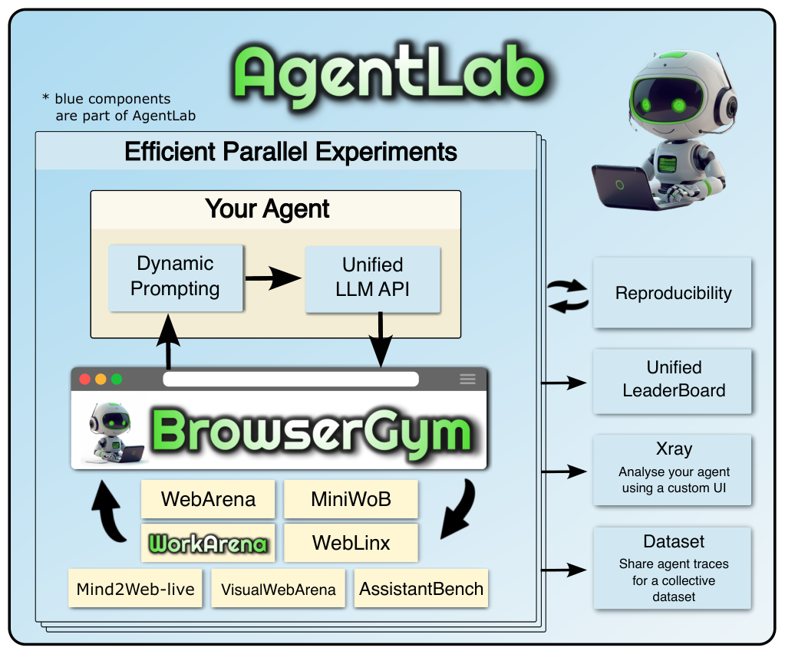
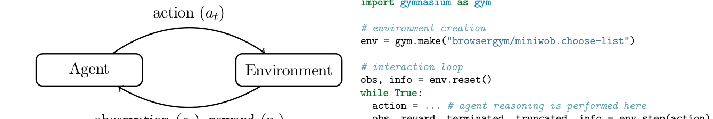
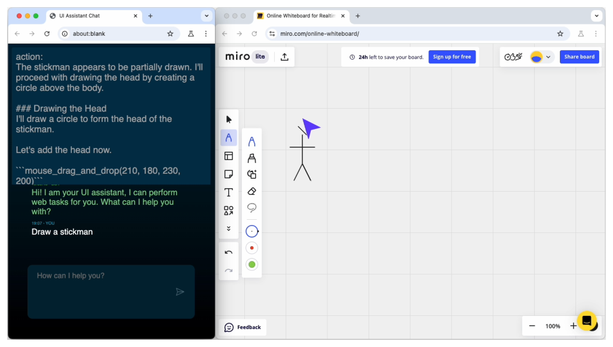
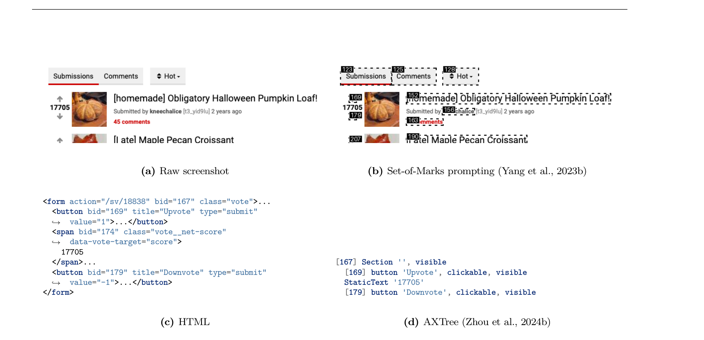
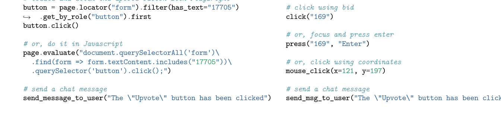

# 《The BrowserGym Ecosystem for Web Agent Research》深度解读

| 项目 | 内容 |
|---|---|
| 论文标题 | The BrowserGym Ecosystem for Web Agent Research（面向 Web Agent 研究的 BrowserGym 生态） |
| 作者 | **Thibault Le Sellier De Chezelles\***、**Maxime Gasse\***、**Alexandre Lacoste\***（\*共同一作）；核心贡献者 Alexandre Drouin、Massimo Caccia、Léo Boisvert、Megh Thakkar、Tom Marty、Rim Assouel、Sahar Omidi Shayegan；Benchmark 贡献者 Lawrence Keunho Jang、Xing Han Lù、Ori Yoran、Dehan Kong、Frank F. Xu；指导 Siva Reddy、Quentin Cappart、Graham Neubig、Ruslan Salakhutdinov、Nicolas Chapados |
| 机构 | ServiceNow Research、Mila、Polytechnique Montréal、Carnegie Mellon University、McGill University、Tel Aviv University、Université de Montréal、iMean AI |
| 发表会议 | arXiv:2412.05467v4（cs.LG，2025-02-28；研究框架，非消费级产品） |
| 论文链接 | [arXiv](https://arxiv.org/abs/2412.05467) |
| 代码链接 | [BrowserGym](https://github.com/ServiceNow/BrowserGym) / [AgentLab](https://github.com/ServiceNow/AgentLab) / [Leaderboard](https://huggingface.co/spaces/ServiceNow/browsergym-leaderboard) |
| 关键词 | Web Agent、Benchmark Unification（基准统一）、Gymnasium Environment、AgentLab、Observation/Action Space（观测/动作空间）、Unified LLM API、AgentXRay、Reproducibility（可复现） |

**摘要（原文）**：

> The BrowserGym ecosystem addresses the growing need for efficient evaluation and benchmarking of web agents, particularly those leveraging automation and Large Language Models (LLMs) for web interaction tasks. Many existing benchmarks suffer from fragmentation and inconsistent evaluation methodologies, making it challenging to achieve reliable comparisons and reproducible results. In an earlier work, Drouin et al. (2024) introduced BrowserGym which aims to solve this by providing a unified, gym-like environment with well-defined observation and action spaces, facilitating standardized evaluation across diverse benchmarks. We propose an extended BrowserGym-based ecosystem for web agent research, which unifies existing benchmarks from the literature and includes AgentLab, a complementary framework that aids in agent creation, testing, and analysis. Our proposed ecosystem offers flexibility for integrating new benchmarks while ensuring consistent evaluation and comprehensive experiment management. This standardized approach seeks to reduce the time and complexity of developing web agents, supporting more reliable comparisons and facilitating in-depth analysis of agent behaviors, and could result in more adaptable, capable agents, ultimately accelerating innovation in LLM-driven automation. As a supporting evidence, we conduct the first large-scale, multi-benchmark web agent experiment and compare the performance of 6 state-of-the-art LLMs across 6 popular web agent benchmarks made available in BrowserGym. Among other findings, our results highlight a large discrepancy between OpenAI and Anthropic's latests models, with Claude-3.5-Sonnet leading the way on almost all benchmarks, except on vision-related tasks where GPT-4o is superior. Despite these advancements, our results emphasize that building robust and efficient web agents remains a significant challenge, due to the inherent complexity of real-world web environments and the limitations of current models.

**摘要（中文）**：

> BrowserGym 生态回应了 Web Agent（尤其是利用 LLM 完成网页交互任务的 agent）在高效评测与基准化方面日益增长的需求。许多现有基准存在**碎片化**与**评测方法不一致**的问题，导致难以进行可靠比较与可复现研究。在早前工作（Drouin et al., 2024）中，BrowserGym 通过提供一个统一的、gym 式环境与明确定义的观测/动作空间来应对这一问题，从而支持跨多样基准的标准化评测。本文提出一个扩展的、基于 BrowserGym 的 Web Agent 研究生态：它**统一了文献中的既有基准**，并包含 **AgentLab**——一个辅助 agent 创建、测试与分析的互补框架。该生态既便于集成新基准，又保证一致评测与完整的实验管理。这种标准化有望降低开发 web agent 的时间与复杂度，支持更可靠的比较与更深入的 agent 行为分析，最终催生更适配、更强的 agent，加速 LLM 驱动的自动化创新。作为佐证，我们开展了**首个大规模、多基准的 web agent 实验**，在 BrowserGym 提供的 6 个流行基准上比较 6 个 SOTA LLM。结果显示 OpenAI 与 Anthropic 最新模型差距显著：**Claude-3.5-Sonnet 几乎在所有基准领先**，仅在视觉相关任务上 **GPT-4o 更优**。尽管如此，结果表明：受真实网页环境的固有复杂性与当前模型的局限所限，构建稳健高效的 web agent 仍是重大挑战。

**TL;DR（太长不想读）**：

> Web Agent 研究被"碎片化"困住：每个基准一套代码、一套评测，横向比较几乎不可能。BrowserGym 生态用**统一接口**破局——BrowserGym 提供 gymnasium 风格的统一观测空间（goal/chat、tabs、DOM+AXTree+bid+bbox、截图、错误反馈）与可扩展动作空间（原始 Playwright Python 或高层原语），**把 6 大基准（MiniWoB++、WebArena、VisualWebArena、WorkArena L1–L3、WebLINX、AssistantBench）统一到同一 API 下**；AgentLab 提供并行实验、统一 LLM API、AgentXRay 可视化。作者还跑了**首个 6 模型 × 6 基准**的大规模实验：Claude-3.5-Sonnet 在 WorkArena L2 达 **39.1%**，而 GPT-4o 仅 8.5%（视觉任务反之）。核心价值是**把"环境"标准化为可复现的实验基础设施**。

---

## Q: 这篇论文试图解决什么问题？（按照引言逻辑）

**引言论证链（§1）：**

1. **领域现状**：LLM/VLM 兴起后，让对话助手"代替用户在浏览器里操作 UI"成为热点；这类任务琐碎重复但多步（填表、比价、同步日历），自动化能释放用户精力，还能提升数字无障碍性。
2. **已有工作的不足（碎片化）**：近年涌现大量 web agent 基准（WebArena、VisualWebArena、WorkArena、WebLINX、AssistantBench、Mind2Web-Live……），但**每个都自带一套评测代码**，形成研究孤岛——安装、数据格式、agent 适配都要各做一遍，导致**难以公平比较、难以复现**。
3. **本文要填补的空白**：能否提供一个**开放、易用、可扩展**的统一框架，把既有基准与 agent 开发/实验统一起来？
4. **一句话研究目标**：> 构建 BrowserGym 生态（统一环境接口 + AgentLab 实验框架），使"设计新 agent / 设计新基准 / 比较不同模型"三件事都能在同一套标准下完成，并用首个大规模多基准实验证明其价值。

**为什么这个问题此刻重要：** 当基准爆炸式增长，"评测基础设施"本身成了瓶颈。若不能跨基准、可复现地比较，领域就会停留在"各说各话"。BrowserGym 把**环境标准化**，等价于为 web agent 研究建立"共同语言"。

---

## Q: 有哪些相关研究？

**① Web Agent 基准（被统一的对象）**
- **MiniWoB / MiniWoB++**（Shi et al., 2017; Liu et al., 2018）：受控环境下的基础网页交互（填表、点按）。
- **WebShop**（Yao et al., 2022a）：电商场景。
- **Mind2Web**（Deng et al., 2023）：2,000+ 人类轨迹 / 137 真实网站。
- **WebArena / VisualWebArena / VideoWebArena**（Zhou et al., 2024b; Koh et al., 2024a; Jang et al., 2024）：在**真实可自托管网站**上评测；VisualWebArena 强调视觉理解。
- **WebLINX**（Lù et al., 2024）：100k+ 人类交互 / 155 真实网站，考察指令跟随。
- **AssistantBench**（Yoran et al., 2024）：214 个需跨站信息综合的真实任务。
- **WorkArena / WorkArena++**（Drouin et al., 2024; Boisvert et al., 2024）：首个企业软件（ServiceNow）知识工作基准。
- **CRMArena**（Huang et al., 2024a）、**MMInA**（Zhang et al., 2024b）、**GAIA**（Mialon et al., 2023）。
- **更广的框架**：AgentBench、AndroidWorld、OSWorld、Windows Agent Arena——把 web 任务作为更通用 agent 环境的一部分。

**② Web Agent 实现（被统一评测的 agent）**
- **HTML 元素直接交互**：Nakano et al. (2022)、Deng et al. (2023)、Gur et al. (2023/2024)。
- **VLM/截图 grounding**：He et al. (2024, Set-of-Marks)、Furuta et al. (2024)、Koh et al. (2024a)；像素级：Shaw et al. (2023)、Cheng et al. (2024)。
- **提示/规划/训练增强**：CoT（Wei et al., 2023）、ToT（Yao et al., 2023）、ReAct（Yao et al., 2022b）、RCI（Kim et al., 2023）；以及专门的 prompt、planning/search、训练方法。

**③ 框架与基础设施**
- **HuggingFace Datasets**（Lhoest et al., 2021）、**UK AI Safety Institute**、**Xie et al. (2023)**、**Pan et al. (2024)**（Mind2Web-Live）、**Zheng et al. (2024b)**。

**定位差异**：本文不提出单个新 agent 或新基准，而是**做"统一 + 实验基础设施"**——把上述分散工作接入同一 API，并给出可复现的大规模横向实验。

---

## Q: 论文如何解决这个问题？（额外对提及的算法和框架进行解释，是什么，为什么用，这篇文章怎么用的）



### ① BrowserGym——是什么 / 为什么用 / 怎么用

- **是什么**：一个**统一的 web agent 环境接口**。用户与 agent 共享一个 chat（交换消息）与一个浏览器（执行打字、点击、开标签页等动作）；用户写指令，agent 导航页面、执行 UI 动作、提取信息、回写消息。
- **为什么用**：把 web agent 交互建模为 **POMDP**（环境提供观测与奖励，agent 产出动作），并用**标准 OpenAI Gym / gymnasium API** 暴露，使不同基准共享同一观测/动作接口。
- **怎么用**：内部基于 **Chromium + Playwright** 自动化浏览器；`gym.make("browsergym/...")` 创建环境，标准 `reset()/step()` 循环。



### ② 丰富的观测空间（§3.1）



- **结构化页面描述**：提供**原始 DOM**（`dom_object`）与 **AXTree 无障碍树**（`axtree_object`），经 Chrome DevTools Protocol (CDP) 提取，仅做最小改动（如注入唯一 id）。
- **额外元素属性**：
  - **bid（BrowserGym ID）**：注入 DOM/AXTree 的**唯一元素标识**，用于无歧义交互；
  - **bbox**：元素包围盒 (left, top, width, height)；
  - **visibility**：可见比例 (0–1)；
  - **set_of_marks**：布尔标志，指示是否应在截图上叠加包围盒（支持 Set-of-Marks 提示）。
- **截图**：当前页面 RGB 截图——弥补 DOM/AXTree 无法反映重叠、背景、图片内容、字体等渲染信息；**bbox 与截图像素坐标精确对应**，便于叠加标记。
- **打开标签页**：`open_pages_urls`、`open_pages_titles`、`active_page_index`。
- **目标与聊天**：`goal_object`（显式目标）或 `chat_messages`（隐式）；支持文本/图片消息，兼容旧式非交互基准。
- **错误反馈**：`last_action_error`——捕获 Playwright 异常（如点击隐藏/禁用元素超时），不中断循环，回传给 agent 促其自纠错。



### ③ 可扩展的动作空间（§3.2）

- **基础动作空间 = 原始可执行 Python 代码**：agent 拿到 Playwright `page` 对象，以及 `send_message_to_user(text)`、`report_infeasible(reason)` 两个函数。表达力极强，但**存在执行任意不可信代码的安全风险**。
- **action_mapping 机制**：环境可用可选的 `action_mapping` 函数把输入动作**转换为可执行 Python 代码**，从而定义更受限、更安全的动作空间（如 JSON/命令行格式的预定义动作列表）；转换异常会被捕获并作为错误反馈回传。
- **高层动作集**：默认使用预定义映射 `HighLevelActionSet`，把高层原语（如 `click(bid)`、`press(bid, key)`、`mouse_click(x,y)`、`send_msg_to_user(...)`）转换为 Playwright 代码；提供 `to_python_code()`（给环境）与 `describe()`（给 agent 的文本描述）。



### ④ 可扩展性：自定义任务（§3.3）

- 只需实现两个方法：**`setup(page)`**（把浏览器带到任务起点并返回目标，可含图片目标）与 **`validate(page, chat_messages)`**（在每步后检查是否完成，返回标量 reward、done 标志与可选聊天消息）。
- 用 `register_task("mynewtask", MyNewTask)` 注册后，即可 `gym.make("browsergym/mynewtask")`。

### ⑤ AgentLab（§5）

- **是什么**：一套工具，用于在 BrowserGym 上**可复现地做并行大规模实验**。
- **包含**：并行实验执行、**统一 LLM API**（便于切换 backbone 模型）、动态提示、**AgentXRay**（可视化内省 agent 在单个任务上的行为）、可复用 agent 构建块。
- **为什么用**：把"评测"从一次性脚本升级为**可管理、可复现、可分析**的实验基础设施。

### ⑥ 基准统一（§4）

- 新增 3 个基准：**WebLINX、VisualWebArena、AssistantBench**；连同既有共支持 **6 个**（含 WorkArena L1/L2/L3）。
- 所有基准通过**同一观测/动作 API** 暴露——任一 agent 可无缝评测于任一基准。
- **收益**：① **打破孤岛**（鼓励通用 agent）；② **加速研究**（新基准自动可评测所有现有 agent）；③ **降低噪声**（跨基准评测提供更强统计信号）。

**当前支持的基准（Table 1 摘要）**

| 基准 | 任务模板数 | 种子多样性 | 最大步数 | 多标签页 | Web 后端 |
|---|---|---|---|---|---|
| MiniWoB(++) | 125 | 中 | 10 | 否 | 自托管页面 |
| WebArena | 812 | 无 | 30 | 是 | 自托管 docker |
| VisualWebArena | 910 | 无 | 30 | 是 | 自托管 docker |
| WorkArena L1 | 33 | 高 | 30 | 否 | ServiceNow demo |
| WorkArena L2 | 341 | 高 | 50 | 是 | ServiceNow demo |
| WorkArena L3 | 341 | 高 | 50 | 是 | ServiceNow demo |
| WebLINX | 31,586 | 无 | 1 | 否 | 无（静态数据集） |
| AssistantBench | 214 | 无 | 30 | 是 | 万维网 |

> 每个基准附带 **metadata**（任务列表 + 属性 + 默认 train/test 划分 + 可选依赖图）与**建议评测参数**。

---

## Q: 论文使用的训练数据，结构细节，来源等详细信息（围绕可复现目标）

> 本文是**基础设施论文**，不训练模型；"数据"是统一后的基准任务与实验配置。

**① 基准任务数据（§4、Table 1）**
- **来源**：均为文献既有基准，经 BrowserGym 统一接入：MiniWoB(++)、WebArena、VisualWebArena、WorkArena（L1/L2/L3）、WebLINX、AssistantBench。
- **规模**：从 33（WorkArena L1）到 31,586（WebLINX）；WebArena 812、VisualWebArena 910、AssistantBench 214、MiniWoB 125、WorkArena L2/L3 各 341。
- **结构**：每个任务是一个 `AbstractBrowserTask`，含 `setup()`（起始状态 + goal）与 `validate()`（reward/done/message）。
- **依赖图**：WebArena / VisualWebArena 提供任务间偏序，避免评测不一致。

**② 观测/动作接口（可复现关键）**
- 观测：`goal_object` / `chat_messages`、`open_pages_urls`/`titles`、`active_page_index`、`dom_object`、`axtree_object`、元素 `bid`/`bbox`/`visibility`/`set_of_marks`、截图、`last_action_error`。
- 动作：原始 Playwright Python，或经 `action_mapping` 的高层原语（`HighLevelActionSet`）。
- 环境：Chromium + Playwright；gymnasium API。

**③ 实验可复现性**
- AgentLab 支持**并行实验**与统一 LLM API；结果进入 **BrowserGym leaderboard**（HuggingFace Space）。
- 提供**默认 train/test split** 与建议评测参数（最大步数、种子多样性）。

**④ 集成路线**：论文列出正在考虑集成 GAIA、WebVoyager、WebShop、Mind2Web-live。

---

## Q: 论文做了哪些实验？

**实验设置（§6）**
- 首个**大规模、多基准** web agent 实验：**6 个 SOTA LLM/VLM**（GPT-4、Claude 3.5、Llama 3.1 家族）× **6 个基准**（BrowserGym 中全部可用）。
- 目标：① 展示生态能力；② 给出 leaderboard 首批条目；③ 回答"用截图是否有用""LLM-A 是否比 LLM-B 更适合 web agent"等跨基准问题。

**主要发现**
- **Claude-3.5-Sonnet 几乎在所有基准领先**：在 **WorkArena L2 达 39.1%** 成功率，而第二名 **GPT-4o 仅 8.5%**——差距惊人。
- **视觉任务例外**：在视觉相关任务上 **GPT-4o 更优**。
- **总体仍困难**：即便最强模型，真实网页环境的固有复杂度 + 当前模型局限，使稳健高效的 web agent 仍是重大挑战。

**生态能力验证**
- 同一 agent 代码可跨基准评测（打破孤岛）。
- AgentXRay 可内省单个任务的 agent 行为。
- 结果作为 leaderboard 首批条目，支持后续可复现比较。

> 注：本解读所依据的抽取文本包含 §1–§4 与引言级结果；§5（AgentLab 细节）与 §6（完整结果表）在原文后续章节，具体逐基准分数请以原 PDF §6 表格为准。

---

## Q: 这篇论文的创新点和可以借鉴的地方

**真创新（基础设施级）**
1. **基准统一**：把 6 个分散的 web agent 基准接入**同一观测/动作 API**，首次实现"一个 agent 跨基准评测"。
2. **统一且可扩展的观测空间**：DOM + AXTree + `bid` + `bbox` + `visibility` + `set_of_marks` + 截图 + 错误反馈，兼顾文本与视觉 agent。
3. **可扩展动作空间**：默认高层原语，可下探到原始 Playwright Python，并用 `action_mapping` 在"表达力"与"安全"间调节。
4. **AgentLab**：并行大规模实验 + 统一 LLM API + AgentXRay 可视化，把评测变成可复现基础设施。
5. **首个 6×6 大规模横向实验** + 公开 leaderboard。

**可借鉴的技巧**
- 用 **gymnasium 标准接口**统一异构环境，降低接入成本。
- 用 **`bid` 唯一标识 + bbox 与截图像素对齐**，让文本 agent 与视觉 agent 共享同一元素定位体系。
- 用 **`last_action_error` 把异常转为可自纠错的反馈**，而非中断循环。
- 用 **`action_mapping` 做安全闸门**，允许在受限与开放动作空间间切换。
- 用 **metadata + 依赖图 + 默认 split** 保证跨任务评测一致性。
- 用**跨基准评测**降低单一基准偏差带来的噪声。

---

## Q: 这篇论文有哪些不足

1. **不提出新算法**：核心贡献是基础设施，对"如何让 agent 更强"本身没有方法性突破。
2. **基准覆盖仍有限**：GAIA、WebVoyager、WebShop、Mind2Web-live 尚在"考虑集成"。
3. **安全风险**：基础动作空间是**可执行任意 Python**，虽有 `action_mapping` 缓解，但默认开放性对不受信环境是隐患。
4. **真实网页的不稳定性**：AssistantBench 等依赖万维网，页面变动会影响可复现性；自托管基准（WebArena）需 docker，部署成本高。
5. **视觉 vs 文本割裂**：论文承认"跨模态/像素级 agent"是开放问题，当前主要面向文本模态 UI。
6. **评测统计功效**：论文强调"跨基准提供更强统计信号"，但未给出完整的显著性/方差分析。
7. **企业基准依赖 ServiceNow demo 实例**：外部复现受环境可得性限制。

---

## Q: 提炼论文的一般技术和逻辑范式

**范式：把"环境"抽象为可复现的标准接口，是 agent 研究的基础设施**

```
异构基准 → 统一观测/动作 API(gymnasium) → AgentLab 并行实验 → 跨基准比较 + 可视化分析
```

可复用的方法论：
1. **统一接口优先于统一实现**：只规定 observation/action 契约，agent 与基准各自演化。
2. **观测要"多模态冗余"**：DOM/AXTree/截图/元素属性同时提供，让不同 agent 各取所需。
3. **动作空间可分层**：高层原语（安全、可控）↔ 原始代码（表达力强），用 mapping 切换。
4. **错误是反馈而非终止**：把异常纳入观测，支持自纠错。
5. **评测即基础设施**：并行、可复现、可可视化（XRay）、可共享（leaderboard）。
6. **跨基准评测降低偏差**：单一基准的结论需在多个基准上验证。

**隐含假设**：① gym/POMDP 抽象足以刻画 web 任务；② 文本 UI 模态可代表多数 web 交互；③ 统一接口不会抹平基准间本质差异；④ leaderboard 能推动领域进步。

---

## Q: 针对这篇文章，思考有哪些值得做的研究话题

**研究主题**

- **上位类研究**：Agent 评测基础设施与基准科学（benchmark/evaluation science）；GUI/Web 自动化 agent。
- **同位类研究**：与 BrowserGym 平行的评测框架/环境（OSWorld、WindowsAgentArena、AndroidWorld、AgentBench、Terminal-Bench）及"统一环境 vs 专用环境"路线之争。
- **下位类研究**：
  - **跨基准可迁移性**：同一 agent 在不同基准上的泛化与偏差分析；
  - **观测表示**（DOM vs AXTree vs 截图 vs SoM）对性能的因果影响；
  - **动作空间安全**与不可信代码执行的沙箱化；
  - **视觉-文本融合** agent（VLM 在 web 任务上的 grounding）；
  - **评测统计**：方差、显著性、种子效应、任务依赖图的影响；
  - **企业/多应用工作流**（WorkArena 式）与跨标签页长程任务。

**数据类型**：
- 各基准的任务元数据（模板、种子、依赖图、split）；
- agent 运行轨迹（观测序列 + 动作 + reward + 错误）；
- 人类交互轨迹（WebLINX 的 100k+）；
- 跨模型、跨基准的评测结果矩阵（用于统计比较）。

**研究设计**：
- **控制变量**：固定 agent 与模型，仅切换观测模态（有无截图/SoM/AXTree）或动作空间（高层 vs 原始），测量性能差异；
- **对照**：单基准 vs 跨基准；不同 backbone 模型；
- **指标**：成功率、步数、成本、方差/置信区间、错误类型分布；
- **预期贡献**：给出"观测/动作设计 → 性能"的可复现因果结论，并推动通用 web agent。

---

<!-- 图表来源：Fig.1 生态总览、Fig.2 渲染环境、Fig.3 交互循环、Fig.4 页面表示、Fig.6 动作对比，均由原 PDF 裁剪（220 DPI）。 -->
